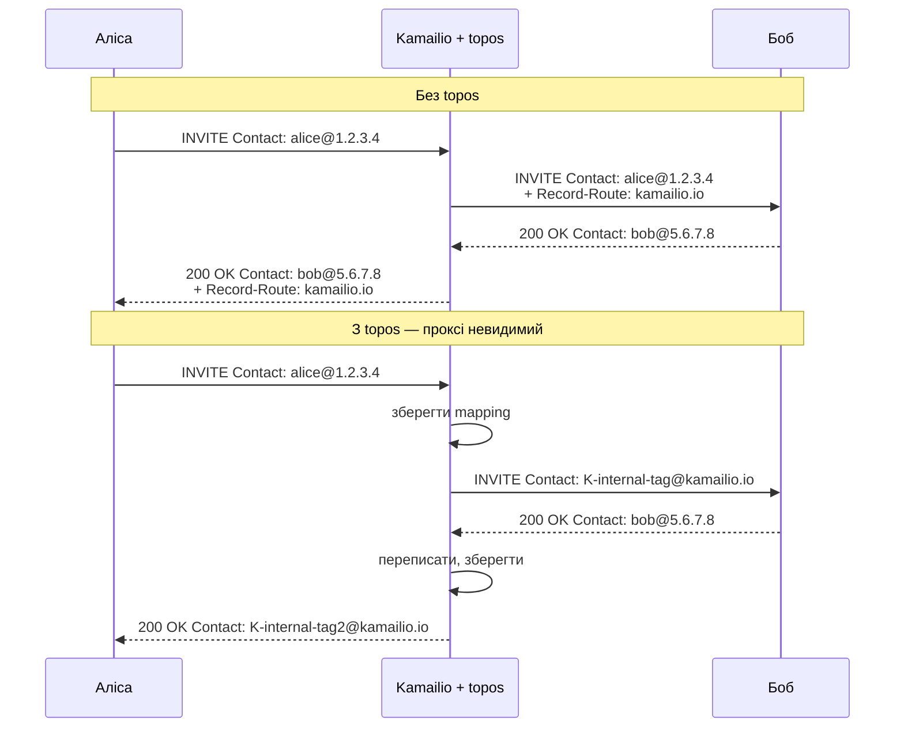

# 8.1 Topology hiding (`topos`)

> [!IMPORTANT]
> SIP-проксі — за RFC — видимий: додає `Via` і `Record-Route`-заголовки, його IP пропагується у Contact-інформацію кожного виклику. **`topos`** — модуль, що переписує кожне in-dialog-повідомлення так, щоб proxy-ланцюг став невидимим для ендпоінтів. Корисно для приховання внутрішньої топології від зовнішніх peer'ів, для routing'у in-dialog-запитів через специфічні шляхи, для прозорого встроєння gateway'у.

## Що ви насправді ховаєте

Коли Kamailio проксіює INVITE, вихідне повідомлення мінімум має:

- **`Via`**, доданий Kamailio, зі своїм IP і branch-параметром.
- **`Record-Route`**, якщо викликаний `record_route()`, з проханням, щоб in-dialog-запити проходили через цей проксі.
- `Contact`-заголовок від UAC, без змін.

Ендпоінти зберігають усе це у своєму dialog-state. Коли callee шле BYE, він використовує route-set, побудований з `Record-Route` — себто шле BYE *до* Kamailio, по IP, з Kamailio-hostname у Route-заголовку. Існування Kamailio постійно афішується у dialog'і.

Для одних операторів це нормально. Для інших — voice carrier'ів, enterprise-gateway'ів, тих, у кого proxy-IP — внутрішня інфраструктура, що не має витікати — це проблема. `topos` переписує повідомлення так, щоб dialog-state на кожному ендпоінті посилався лише *на себе*, не на проксі.

## Що `topos` робить насправді

На вихідному INVITE до Боба `topos` зрізає Contact Аліси і замінює його Kamailio-managed-ідентифікатором. На 200 OK назад до Аліси — зрізає Бобів Contact і замінює іншим Kamailio-ідентифікатором. Бобів BYE шле «alice via Kamailio-identifier», але ідентифікатор резолвиться лише всередині Kamailio — Боб ніколи не дізнається реальний IP Аліси.

In-dialog-запити працюють через **lookup**: кожен BYE, re-INVITE з topos-managed-ідентифікатором тригерить Kamailio знайти оригінальний Contact у своєму mapping'у, відновити, форвардити.

## Mapping-таблиця

`topos` тримає mapping у shm, ключований на token'і, який вбудовує у переписані заголовки. Таблиця тримає:

- Token (Kamailio-ідентифікатор).
- Оригінальний Contact URI з обох боків.
- Оригінальний Record-Route set.
- Dialog-ідентифікатори (Call-ID, From-tag, To-tag) для матчингу.
- Timestamp'и для expiry.

Таблиця — per-bucket-локована, рівно як `tm` і `usrloc` (розділ 6). Hash size і lock-count — налаштовуються.

У базовому `topos` mapping shm-only. **`topos_redis`** — варіант, що тримає mapping у зовнішньому Redis. Кілька Kamailio-інстансів можуть шарити topology-hiding-стан, і виклик, що пережив рестарт інстансу, все одно матиме правильне переписування in-dialog'ів.

## Чому це архітектурно важить

`topos` — один з найясніших прикладів того, чому lump-система (розділ 3.3) — несуча. Topology hiding вимагає, щоб проксі переписував Contact і Record-Route на **кожному** повідомленні виклику — вихідному INVITE, вхідному 200 OK, ACK в обидва боки, BYE в обидва боки, кожному re-INVITE. Без lumps це було б buffer-copy per rewrite per message. З lumps кожен rewrite — це поставлена в чергу операція, а складання відбувається одним проходом у момент send'у.

Це також показує цінність `dialog`. Природне місце для mapping'у — ключований на dialog-ідентифікаторах — а `dialog` вже тримає record per call. `topos` може повісити свої дані на існуючий dialog-record (або тримати паралельну структуру, залежно від конфігу).

## Коли використовувати

Беріть `topos`, коли:
- Ви на peering-кордоні і не хочете, щоб внутрішні IP витікали до зовнішніх peer'ів.
- Потрібно, щоб кожен in-dialog шов певним шляхом через інфраструктуру, незалежно від того, що б природно зробили ендпоінти.
- Ви прозоро вставляєте проксі в існуючу топологію, і обидва ендпоінти мають поводитися, ніби його немає.

Пропускайте, коли:
- Топологія внутрішня і видимість нешкідлива.
- shm-бюджет тісний, call-concurrency високий — `topos` коштує ~сотні байтів на активний dialog.
- Ендпоінти залежать від реального Contact'а одне одного (рідко, але буває з кастомними SIP-клієнтами).

## Operational gotcha

> [!WARNING]
> **Без `topos_redis` рестарт Kamailio вбиває всі in-flight topos-managed-виклики.** Mapping кожного виклику в shm; рестарт стирає shm; наступний BYE на цей виклик б'є в порожню mapping-таблицю, і Kamailio не знає, куди його слати. З `topos_redis` mapping переживає рестарт, бо Redis — переживає.

- **`topos` додає latency.** Кожне переписане повідомлення коштує mapping-lookup чи insert'у. Sub-мілісекунда, але реально.
- **Формат token'а — внутрішній.** Не покладайтеся на парсингу зовнішніми тулами.
- **Парте з `dialog`.** Без dialog-tracking у `topos` немає природного місця для expiry mapping'ів, окрім власних таймерів — легше leak'нути.

Наступний розділ — про інший тип архітектурного трюку: зробити route асинхронним, щоб воркер не блокувався.

---

  <a href="./">← Зміст</a> · <a href="18-usrloc.md">← 6.3 Патерн usrloc</a> · <a href="20-async-transactions.md">Далі: 8.2 Async-транзакції →</a>

