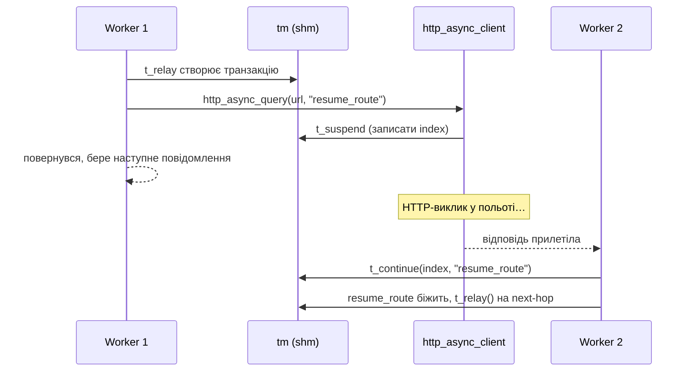

# 8.2 Async-транзакції — `t_suspend` / `t_continue`

> [!IMPORTANT]
> Worker-модель Kamailio (розділ 2.1) каже: один воркер зайнятий одним повідомленням від початку до кінця. Async-transaction-примітив — `t_suspend()` / `t_continue()` — це архітектурний escape hatch з цього правила. Він — те, що дозволяє route'у зробити повільний зовнішній виклик (HTTP, БД, кастомний протокол), не паркуючи воркера до повернення.

## Проблема

Воркер, що дзвонить `http_client.curl(...)` у cfg синхронно, блокується. Увесь `request_route` стоїть, поки HTTP-сервер не відповість. З `children=8` і upstream-HTTP-сервісом, що відповідає за 200 мс, ви обробите максимум **40 повідомлень/с на весь інстанс**, поки робите цей HTTP-виклик — бо вісім воркерів × 5 msg/с = вся пропускна.

Гірше — ядро складає вхідні SIP-пакети у socket-чергу, поки воркери застрягли. Якщо черга переповнюється — починаєте дропати на kernel-рівні, невидимо для застосунку.

Можна кинути більше воркерів у проблему, але більше воркерів = більше shm-pressure, більше contention на кожному hot-path, і врешті стіна десь на 64–128 child'ах.

Архітектурна відповідь — **відпустити воркера**, поки повільний виклик у польоті, і повторно увійти у route, коли результат готовий.

## `t_suspend()` і що він робить

`t_suspend()` — C-функція (експонована скрипту як `t_suspend()`, KEMI — `KSR.tm.t_suspend()`), що робить:

1. Каже поточній `tm`-транзакції «я ставлю на паузу — не тайм-аут'ься поки що, не relay'ь нічого, не стріляй branch/failure-route, поки я не скажу».
2. Виділяє маленький **suspension-index** — token, що ідентифікує цей паузований стан.
3. Повертає скрипту.

Скрипт тепер може записати index кудись зовні (у HTTP-запит як callback-ID, у job-чергу тощо), викликати `exit`, і **воркер повертається у `recvfrom`-loop**, щоб обробляти наступне повідомлення. Транзакція жива у hash-таблиці `tm`; ніхто її не чекає; нічого з нею не відбувається, поки хтось не дзвонить `t_continue()`.

## `t_continue()` і resume-шлях

Через деякий час — мілісекунди чи секунди — async-операція завершується. Результат — якась подія у системі: HTTP-відповідь прилетіла, DB-запит завершився, таймер стрельнув. Той модуль, що обробляє подію, дзвонить:

```c
t_continue(suspension_index, "resume_route", "result_arg")
```

Що робить:
1. Знаходить suspend'нуту транзакцію по index'у.
2. Будить її в `tm`.
3. Scheduling'ує іменований cfg-route (`resume_route`) на виконання з результатом у `$avp` чи `$var`.
4. Наступний воркер, що підхопить wake-up, біжить цей route — типово `t_relay()`, `t_reply()` чи наступний async-hop.



Важливо — **`t_continue()` може виконатися в іншому воркері**, ніж той, що дзвонив `t_suspend()`. Транзакція у shm; будь-який воркер може її відновити. Це й те, що дозволяє моделі масштабуватися — async-роботу підхопить той воркер, що вільний у момент приходу результату.

## Модулі, що це використовують

Кілька модулів побудовано навколо `t_suspend` / `t_continue`:

- **`http_async_client`** — fire-and-forget HTTP-запит, route відновлюється з response body у AVP.
- **`db_redis`** (з async-варіантами) — Redis-запити, що не блокують воркер.
- **Кастомні протоколи через `tm_async`** — будь-хто, хто імплементує зовнішній виклик, може провести через цей примітив.
- **Event route'и** — `event_route[some:trigger]`, що біжить на `t_continue`'нутій транзакції.

Патерн уніформний: «fire»-виклик, що записує suspension і повертається, плюс «result handler», що дзвонить `t_continue()`, коли прилетів результат.

## Що suspension робить з таймерами транзакції

Нормальний final-response-timer `tm`'у (`tm_max_inv_lifetime`, дефолт 180 с) усе ще цокає під час suspension. Якщо ви `t_suspend()` і ніколи не `t_continue()` — транзакція врешті тайм-аут'нiться і запустить `failure_route` (або провалиться тихо, якщо не виставлений).

Це **leak-protection**: async-операція, що загубилася, не запіне shm назавжди. Але це й означає, що ви маєте розмірити тайм-аути так, щоб найдовший правдоподібний async-resume стався добре в межах `tm_max_inv_lifetime`. HTTP до flaky-upstream'а з 60-секундним тайм-аутом — нормально; з 5-хвилинним — буде reaped `tm`'ом до того, як result прилетить.

## Стан через кордон

Що переживає suspend/resume-розрив:

- **Транзакція у shm.** Включно з branch'ами, lumps у черзі, хуками.
- **AVP і `$var(...)`** — стоп. `$var()` — per-process, pkg-пам'ять; **не** переживає кордон. AVP — переживають, бо живуть на транзакції.
- **`sip_msg`** — частково. `tm` скопіював повідомлення у shm; resume'нутий route оперує на копії.

> [!TIP]
> Якщо треба передати дані з pre-suspend у post-resume — **беріть AVP** (`$avp(name)`), **dialog-змінні** (`$dlg_var(name)`, якщо вмикнутий `dialog`), або передавайте через callback-args async-модуля. Не покладайтеся на `$var()` — їх не буде.

## Ціна і ліміти

Ціна одного suspend/resume-циклу:
- Одна маленька shm-алокація для suspension-index.
- Ще два hash-table-touch'ів у `tm`-таблиці (один — на suspend, один — на resume).
- Ціна re-entering cfg-route'у на resume-точці.

Разом: десятки мікросекунд + ціна зовнішньої операції. Дешево.

Ліміт: `tm_max_inv_lifetime` (дефолт 180 с) і shm-capacity. Можна мати десятки тисяч одночасно suspend'нутих транзакцій, якщо у shm є місце.

## Коли використовувати

Беріть `t_suspend`/`t_continue`, коли:
- Route'у треба зробити повільний зовнішній виклик (>10 мс).
- Інтегруєтесь із системою, чий response-time повністю не контролюєте.
- Throughput-цілі вимагають більше concurrent-викликів у польоті, ніж worker count може тримати синхронно.

Пропускайте, коли:
- Зовнішній виклик швидкий і обмежений (<1 мс, типу локального memcached) — bookkeeping-ціна може переважити.
- Route не робить зовнішніх викликів — async додає складність без виграшу.

Наступний розділ — про інший тип cross-message-стану: `htable`, generic shm-hash, що підпирає багато з цих async-resume-патернів.

---

<p align="center">
  <a href="./">← Зміст</a> · <a href="19-topos.md">← 8.1 Topology hiding</a> · <a href="21-htable.md">Далі: 8.3 htable →</a>
</p>
