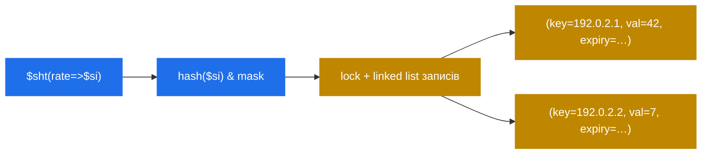

# 8.3 `htable` — hash-таблиці у спільній пам'яті як «бідний Redis»

> [!IMPORTANT]
> Кожне нетривіальне розгортання Kamailio врешті потребує «місця, куди класти стан, спільний між воркерами і трохи довший за одне повідомлення». Auth-кеші, rate limiter'и, per-call decision tag'и, dedup-лічильники. `htable` — це відповідь: generic key-value-store у shm з per-bucket-локами, per-entry TTL, опційним DB-backing'ом і прямим доступом зі скрипта і KEMI. Це **найбільш перевикористовуваний архітектурний патерн у будь-якому нетривіальному cfg Kamailio**.

## Форма

```kamailio
modparam("htable", "htable", "auth_cache=>size=10;autoexpire=300;")
modparam("htable", "htable", "rate=>size=8;autoexpire=60;")
modparam("htable", "htable", "cache=>size=12;dbtable=kamailio_cache;dbmode=2;")
```

Кожне `htable`-оголошення декларує **незалежну іменовану таблицю**: кількість bucket'ів (`size=N` означає 2^N), expiry-політика (`autoexpire` у секундах), опційно DB-таблиця для persistence.

Зі скрипта:

```kamailio
$sht(auth_cache=>$au) = "$Ts";
if ($sht(rate=>$si) > 100) {
    sl_send_reply("429", "Too Many Requests");
    exit;
}
$sht(rate=>$si) = $sht(rate=>$si) + 1;
```

`$sht(<table>=><key>)` читає й пише. Читання відсутнього ключа — null; запис — insert. Уся conструкція — це один hash-lookup плюс одне взяття bucket-локу на операцію.

## Що насправді у shm



Структура має виглядати знайомо: per-bucket-шардована hash, один лок на bucket, linked list записів у кожному. Той самий патерн, що `tm`, `dialog`, `usrloc`. `htable` просто експонує його як general-purpose facility, а не прив'язує до конкретного use case'у.

Записи тримають:
- **Key** (string).
- **Value** — string або int (одне з, не обидва).
- **Expiry** — абсолютний timestamp; sweeper-процес чистить past-deadline.
- **Update timestamp** — для stale-check.

## Чому script-write'ери постійно до нього тягнуться

cfg DSL не має структур даних (розділ 3.4 / 4.1). Єдиний спосіб пам'ятати щось між двома повідомленнями — і шарити це між воркерами — це покласти у shm. `htable` — найлегший шлях: жодної схеми, жодної БД, жодного зайвого модуля, жодної operational-церемонії. Поширені патерни:

**Auth-cache.** Після успішної digest-auth зберегти `(user → auth-token-with-expiry)`. Подальші запити з тим самим юзером і тим самим токеном пропускають важкий auth-шлях:

```kamailio
if ($sht(auth_cache=>$au) == $hdr(Authorization)) {
    # cached hit, пропустити важкий auth
    route("post_auth");
}
```

**Per-source rate-limiting.** Лічити запити per source-IP per second:

```kamailio
$sht(rate_per_ip=>$si) = $sht(rate_per_ip=>$si) + 1;
if ($sht(rate_per_ip=>$si) > 100) { exit; }
# `autoexpire=1` на таблиці робить це rolling-1-second-counter
```

**Dedup / replay-захист.** Пам'ятати Call-ID пару секунд; рubжіти дублікати:

```kamailio
if ($sht(seen=>$ci) != $null) { exit; }
$sht(seen=>$ci) = 1;
```

**Per-call decision tagging.** Загвинтити рішення рано в `request_route`, щоб `branch_route` і `failure_route` могли прочитати назад.

## DB-backed варіант

Два `dbmode` для таблиць з persistence:

- **`dbmode=2`** — read-through і write-through. Lookup'и, що пройшли мимо кешу, провалюються до БД; запис йде в обидва. Найповільніше, найбільш консистентно.
- **`dbmode=3`** — write-back. Запис у shm only; періодичний flush пише dirty-записи в БД. Читання — shm-only. Найшвидше, eventually-consistent.

DB-backed корисний для таблиць, що:
- Мають пережити рестарт (auth-кеші, rate-limit-вікна, allow-list'и).
- Наповнюються зовнішніми системами (CRM оновлює таблицю; Kamailio читає).

Для ephemeral'ного стану (per-second rate counters, in-flight transaction tags) — пропустіть БД, `autoexpire` почистить.

## RPC-керування

Рантайм експонує вміст htable через RPC — величезно для дебагу:

```bash
kamcmd htable.dump auth_cache              # надрукувати всю таблицю
kamcmd htable.get auth_cache alice@x.com   # один ключ
kamcmd htable.sets rate_per_ip 1.2.3.4 0   # set ключ (str)
kamcmd htable.setxs rate_per_ip 1.2.3.4 0  # set з expiry
kamcmd htable.delete rate_per_ip 1.2.3.4   # delete
kamcmd htable.reload my_cache              # reload з БД
```

`htable.dump` — те, до чого тягнешся, коли в продакшні щось дивно. Це команда «подивитися всередину shared-state». Дешевше за debugger; фокусніше за log-dump.

## Sizing і operational-нюанси

Дві кнопки, що мають значення:

- **`size`** — кількість bucket'ів — `2^size`. Ставте так, щоб очікувана кількість живих записів per bucket була маленькою (≤10 ідеально). На 10 000 записів: `size=10` (1024 bucket'и, ~10 entries per bucket).
- **`autoexpire`** — як довго запис живе без дотику. Впливає на shm-споживання напряму.

> [!TIP]
> Дебажачи скрипт із htable — **спершу dump, потім reasoning**. Стан observable; не треба вгадувати.

## Ліміти і anti-patterns

`htable` — не БД, не Redis, не черга. Практичні ліміти:

- **Немає атомарного compare-and-set.** Можна прочитати і записати, але між цими двома операціями може встрянути інший воркер. Для лічильників зазвичай нормально (off-by-one у rate-limiting не критично). Для обережніших state-machine'ів треба проектувати навколо.
- **Немає ітерації зі скрипта.** Не можна loop'ити по записам таблиці в cfg. (KEMI має через `KSR.htable.dump`-callback'и, але це не zero-cost.)
- **Немає транзакцій.** Multi-table-update'и не атомарні.
- **shm обмежений.** Не кладіть unbounded-дані сюди — auth-кеші без TTL, dedup-таблиці, що не чистяться.

Беріть `htable` за те, чим він є: маленький, швидкий, observable shm-state. Для справжніх БД-потреб — справжня БД. Для справжніх queue-потреб — справжня queue.

Наступний розділ бере найпоширеніше застосування `htable`-shape-мислення — розподіл call-routing'у між кількома back-end'ами — і копає, як `dispatcher` робить це добре.

---

<p markdown="1" align="center">
  [← Зміст](../) · [← 8.2 Async-транзакції](20-async-transactions.md) · [Далі: 8.4 dispatcher →](22-dispatcher.md)
</p>
