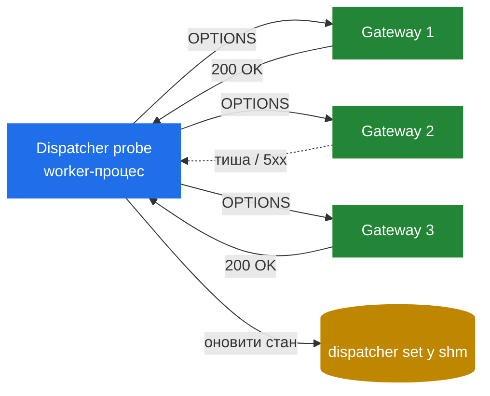

# 8.4 `dispatcher` — алгоритми та stickiness

> [!IMPORTANT]
> Розподіл викликів між back-end'ами — gateway'ами, PBX'ами, медіасерверами — одна з найпоширеніших речей, що робить SIP-проксі. Модуль `dispatcher` — load-balancing-примітив Kamailio: набір destination'ів, алгоритм вибору, dead-detection через probing і per-call-stickiness, що тримає обидві половини виклику на одному back-end'і. Не блискуче, але вибір алгоритмів — цікавий.

## Що таке dispatcher насправді

**Dispatcher set** — це іменована, нумерована група destination'ів:

```
1 sip:gw1.internal:5060 0 60 "uri=sip:check@gw1.internal"
1 sip:gw2.internal:5060 0 60 "uri=sip:check@gw2.internal"
1 sip:gw3.internal:5060 0 60 "uri=sip:check@gw3.internal"
```

Set 1 має три destination'и. На рядок: address, прапори, priority, атрибути. Set вантажиться з таблиці БД (чи файла) на старті, тримається у shm. `dispatcher.reload` RPC оновлює без рестарту.

Зі скрипта:

```kamailio
ds_select_dst("1", "4");   # set 1, алгоритм 4 (round-robin)
t_relay();
```

Цей виклик обирає один destination з set 1 алгоритмом 4, ставить request-URI відповідно, повертає. Наступний `t_relay()` шле на обраний destination.

## Алгоритми

`dispatcher` шипиться з дюжиною+ алгоритмів. Архітектурно цікаві:

| Алгоритм | Що робить | Коли |
|---|---|---|
| 0 — hash по Call-ID | Той самий Call-ID → той самий destination | Per-call stickiness для stateless dispatch |
| 1 — hash по From URI | Той самий caller → той самий destination | Per-user stickiness |
| 2 — hash по To URI | Той самий callee → той самий destination | Anti-affinity, якщо виклики до одного callee мають консолідуватися |
| 4 — round-robin | Кожен виклик до наступного у послідовності | Чистий load-розподіл, без stickiness |
| 7 — hash по Authorization | Той самий auth-identity → той самий destination | Auth-aware stickiness |
| 8 — random | Випадково | Stateless-розподіл без патернів |
| 10 — priority + weight | Виборка за priority з вагами | Active/standby з primary-перевагою |

**Hash-алгоритми (0–3, 7)** використовують той самий механізм: hash інпуту modulo кількості *активних* destination'ів, обирає той. Дають per-call-stickiness *поки destination-set стабільний*. Якщо destination помер і прибраний з active-list'у, modulo змінюється — всі hash'і зсуваються. Виклик sticky всередині стабільної топології, не через зміни топології.

**Round-robin (4)** тримає один counter per set у shm, інкрементить per call, бере modulo destination-count. Counter, шарений між воркерами, потребує локу на інкремент — дешево (інкремент — одна atomic-op), але серіалізує між воркерами коротко. На дуже високому CPS (>50k) counter може стати contention-точкою.

**Priority+weight (10)** дозволяє сказати «80% на gateway A, 20% на gateway B, fall back на C, якщо обидва впали». Алгоритм бере destination за вагою; якщо мертвий (по probing) — пробує наступний priority-bucket.

## Probing — знаючи що живе

Щоб load-balancing мав сенс, треба знати, які destination'и активні. `dispatcher` робить це **періодичним пінгом** кожного destination'у SIP-OPTIONS-запитом («ти живий?»).



Виділений worker-процес (з розділу 2.1) обробляє probing. Інтервал (`ds_ping_interval`), threshold для маркера «мертвий» (`ds_probing_threshold`), критерії «знову живий» (`ds_inactive_threshold`) — все налаштовується.

Стан destination'у в in-shm-dispatcher-set'і: active, probing (тимчасово вимкнений), trying (повернувся з мертвих, на іспитовому терміні). Routing-рішення дивляться на стан і скіпають inactive.

## Stickiness — у деталях

Якщо вмикнутий алгоритм 0 (Call-ID hash), він гарантує:
- Кожне повідомлення з тим самим Call-ID потрапляє на той самий destination.

Це важить, бо:
- Для setup'у виклику (INVITE → 200 OK → BYE) всі три повідомлення мають іти на той самий back-end, щоб у нього був консистентний стан.
- Для re-INVITE посеред виклику — той самий back-end.
- Для повторного виклику до того ж destination AOR (Боб дзвонить Алісі, потім Аліса передзвонює Бобу) — routing бажано через той самий gateway для accounting'у.

Алгоритм досягає цього **без per-call-state** — чистий хешинг. Жодної shm-ціни на stickiness, лише існуюча dispatcher-таблиця. Це критично на масштабі: мільйон concurrent-викликів коштував би мільйон entries при будь-якій stateful-stickiness-схемі; з hash-based — нуль.

Ціна hash-based-stickiness — проблема topology-instability вище. Якщо `dispatcher.reload` біжить під час активних викликів і destination-список змінюється, hash'і зсуваються. Нові виклики йдуть на нові destination'и; in-flight in-dialog-запити можуть знайти правильний destination (якщо Call-ID все ще хешується на той самий gw — *якщо* set не скоротився) або ні.

## Sets і gateway'і

Розгортання `dispatcher`'а зазвичай має кілька сетів, кожен зі своїм алгоритмом і призначенням:

- **Set 1** — outbound carriers (round-robin або weighted priority).
- **Set 2** — internal PBX gateways (hash по Call-ID для stickiness).
- **Set 3** — медіасервери (hash по To URI для callee-affinity).

Скрипт обирає, у який set dispatch'ити, на основі routing-правил — outbound виклики у set 1, internal у set 2, recording inserts у set 3.

## Операційне використання

```bash
kamcmd dispatcher.list                  # показати всі сети і стан destination'ів
kamcmd dispatcher.set_state ai 1 sip:gw1:5060   # пометити active/inactive
kamcmd dispatcher.reload                # перезавантажити таблицю з БД
```

`dispatcher.list` — operational-дашборд. Показує стан кожного destination'у, останній probe-результат, last-success timestamp. Якщо destination flapping'ує — timestamp'и розкажуть.

## За межами dispatcher'а

`dispatcher` — патерн «статичний load-balancer у shm». Для динамічніших потреб ті самі архітектурні ідеї спливають деінде:

- **`uac_redirect`** — re-route'инг по 3xx-відповідях.
- **DNS SRV-based routing** — DNS дає destination-set; кешуємо у shm.
- **External service discovery** — KEMI-скрипт дзвонить Consul/etcd, наповнює htable, dispatcher читає.

Архітектурний патерн, спільний для всіх: **destination'и у shm, probing/DNS/HTTP для liveness, алгоритм обирає, lookup lock-cheap**. Раз вкоренивши форму — бачите її всюди.

Наступний розділ — про координацію стану між кількома інстансами Kamailio — `dmq`.

---

<p markdown="1" align="center">
  [← Зміст](../) · [← 8.3 htable](21-htable.md) · [Далі: 8.5 dmq →](23-dmq.md)
</p>
