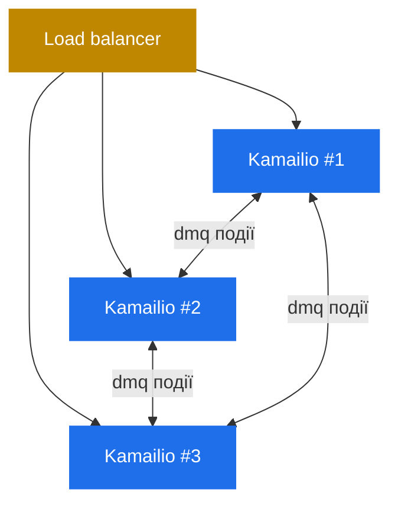

# 8.5 `dmq` — розподілений стан між інстансами

> [!IMPORTANT]
> Усе описане в part 6 — `tm`-транзакції, `dialog`-record'и, `usrloc`-контакти, `htable`-entries, `dispatcher`-state — живе в shm **одного інстансу Kamailio**. У момент, коли ви ганяєте два Kamailio-інстанси за load-balancer'ом, ті shm-області незалежні, і ніщо їх не синхронізує. **`dmq`** — Distributed Message Queue — це fabric, що пропагує зміни стану між інстансами.

## Проблема кількох інстансів

Три Kamailio-інстанси за load-balancer'ом ділять inbound-трафік. REGISTER від Аліси потрапляє на інстанс #1. Контакт Аліси опиняється в `usrloc`-кеші інстансу #1. Через п'ять секунд Боб дзвонить Алісі. INVITE приходить на інстанс #2 (інший воркер, інша машина).

Інстанс #2 шукає Алісу у своєму `usrloc` — і не знаходить. Аліса зареєстрована, але лише на інстансі #1. Виклик провалюється.

Фікс — змусити стан реплікуватися. Кожна зміна стану на будь-якому інстансі має fan-out'итися на всі інші. `dmq` — шина, що це робить.

## Що таке `dmq` насправді

Peer-to-peer-мережа над SIP. Кожен Kamailio-інстанс — `dmq`-нода. Ноди знають про одна одну (статично сконфігуровані чи виявлені) і обмінюються повідомленнями через спеціальний SIP-транспорт — насправді ті ж listening-сокети, просто з іншим SIP-методом/route'ом.



Коли модуль на одній ноді хоче транслювати стан, він публікує повідомлення на іменованому `dmq`-«каналі» (usrloc, dialog, htable, dispatcher — кожен має свій). Кожна інша нода, підписана на канал, отримує повідомлення і застосовує оновлення у власному shm.

Транспорт — звичайний SIP. `KDMQ` (custom SIP-метод) запит йде з ноди в ноду. Receiver парсить, диспетчеризує по імені каналу до потрібного модуля, модуль оновлює in-memory-стан.

## Канали і що реплікується

Кожен модуль, що підтримує dmq, реєструє свій channel-handler. Well-known:

| Модуль | Канал | Що реплікується |
|---|---|---|
| `usrloc` | `usrloc` | Insert'и, update'и, delete'и контактів |
| `dialog` | `dialog` | State-переходи dialog'а (early → confirmed → terminated) |
| `htable` | per-table-канал | Insert'и і delete'и entries (налаштовується per table) |
| `dispatcher` | `dispatcher` | Зміни state destination'ів (active/inactive) |
| `dmq_usrloc` | dedicated | Спеціалізована usrloc-only-реплікація з сильнішою впорядкованістю |

Список росте, по мірі того як модулі додають dmq-підтримку. Патерн той самий: коли модуль мутує in-shm-стан, серіалізує зміну і публікує; receivers десеріалізують і застосовують.

## Топологія кластера і membership

`dmq`-кластер налаштовується:

1. **Списком peer-URI** (кожна нода знає SIP-адреси кожної іншої).
2. **Самоідентифікацією** (кожна нода має свій URI для публікації).
3. **Підпискою на канали** (які модулі беруть участь у реплікації).

Коли нода стартує, вона вітає peer'ів `KDMQ`-реєстрацією. Peer'и додають її у свій recipient-список. Коли нода падає — peer'и помічають (probing чи failed-send) і перестають слати.

Немає leader-election, немає quorum'а — flat-mesh. Усі ноди рівні. Ціна — **O(N²)-з'єднань** для N нод; простота того варта до кількох десятків нод.

Для більших кластерів архітектурна відповідь — не складніша dmq-топологія, а **шардинг load-balancer'а** перед Kamailio (consistent-hashing inbound-трафіку по юзеру), щоб кожен shard був маленьким dmq-кластером.

## Модель консистентності

`dmq` — **eventually consistent**. Немає транзакційної гарантії, що всі ноди застосують update в один момент. Порядок:

1. Модуль на ноді A мутує свій shm.
2. Модуль публікує зміну в dmq.
3. Через мілісекунди ноди B і C отримують повідомлення і застосовують.

Між кроками 2 і 3 ноди B і C мають stale-state. Для більшості репліцоваого стану — реєстрацій, dialog-state, dispatcher-liveness — це нешкідливо. REGISTER, що ще не дійшов — просто трохи затриманий перший виклик від юзера. Termination dialog'а, що ще не дійшов — трохи затриманий cleanup на інших нодах.

Що **не** ок — це **будь-що, що залежить від строго-консистентного view між нодами**. dmq — не coordination-примітив; це replication-шина. Якщо потрібні крос-нодові локи — зовнішня система (Redis, ZooKeeper) — правильне місце. dmq не замінює.

## Failure-режими

Кілька речей, що варто відстежувати:

> [!WARNING]
> **Network partition між dmq-peer'ами призводить до split-brain у стані.** Обидві сторони продовжують мутувати свій shm і публікувати локально, але partition не дає пропагуватися. Коли мережа лікується — обидві сторони намагаються push'нути накопичені зміни — і порядок застосування невизначений. Стан може зійтися непередбачувано.

- **Повільний dmq-peer може back-up'нути локальну чергу.** Якщо нода B повільна — publish-to-B з ноди A займає довше. Поведінка модулів варіює — одні блокують, одні дроп'ять, одні черговують з bounded-розміром.
- **Реплікація множить write-load.** Кожен REGISTER, що ви обробляєте локально, також стріляє N-1 dmq-send'ів до peer'ів. Для високого CPS REGISTER'ів на багатьох нодах сам dmq-трафік може бути значним.
- **Модулі не все реплікують.** `dialog` реплікує state-переходи, не повний вміст dialog'а. Якщо треба багатий per-call-стан на кожній ноді — `dialog`'ова dmq-реплікація може не вистачити; `topos_redis` чи справжній distributed-store.

## Коли dmq, коли Redis

`dmq` правильний, коли:
- Ви ганяєте 2–10 Kamailio-інстансів.
- Стан для реплікації маленький per item (контакти, dialog-ідентифікатори, htable-ключі).
- Eventual-consistency норм.
- Не хочеться додавати зовнішню залежність.

Справжній зовнішній store (Redis зазвичай) правильний, коли:
- Багато інстансів (20+).
- Стан великий (повна call-recording-metadata, глибокі auth-кеші).
- Потрібна сильніша consistency чи query-можливості (TTL, atomic-op, range-query).
- Шарите стан з не-Kamailio-сервісами.

На практиці великі оператори використовують **обидва**: dmq для дешевого швидко-реплікованого стану (registrar-контакти, dispatcher-liveness), Redis (чи аналог) для того, що потребує справжньої persistence і сильних query.

## Операційне використання

```bash
kamcmd dmq.list_nodes      # показати dmq cluster-membership з POV цієї ноди
kamcmd dmq.process         # тригернути один раунд обробки повідомлень руками
```

`dmq.list_nodes` — operational-еквівалент «чи живий кластер?» — показує known-state кожного peer'а (`up`, `pending`, `disabled`) і час останнього контакту. Peer, що довго мовчить — перший знак propagation-проблеми.

## Чому це правильне завершення розділу про фішки

`dmq` — архітектурна частина, що перетворює Kamailio з «потужний single-box SIP-сервер» на «scale-out SIP-платформу». Кожна інша частина, про яку ви читали — process model, shm, lumps, transactions, dialogs, KEMI, topos, async, htable, dispatcher — існує на масштабі одного інстансу. `dmq` — шов, що дозволяє оперувати багатьма з них так, ніби це один. Жодна з них не дизайнилася під distribution зі старту; `dmq` додає це як opt-in retrofit, що чесно і працює.

Фінальна частина посібника — reference-матеріал: глосарій ролей процесів і карта термінів.

---

<p align="center">
  <a href="./">← Зміст</a> · <a href="22-dispatcher.md">← 8.4 dispatcher</a> · <em>Далі: Reference (готується)</em>
</p>
