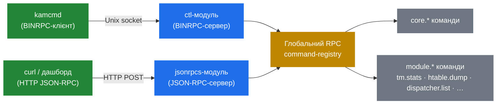

# 7.1 Архітектура RPC

> [!IMPORTANT]
> Усе, що оператори роблять для інспекції чи маніпуляції живим Kamailio — `kamcmd`, HTTP-health-check'и, дашборди, reload-скрипти — іде через один з двох RPC-шарів: **BINRPC** (бінарний, через Unix-сокет, швидкий) або **JSON-RPC** (текстовий, через HTTP, integration-friendly). Обидва експонують ту саму множину зареєстрованих команд. Вибір — суто транспорт, не capability.

## Форма

Кожен модуль, що хоче експонувати runtime-функціональність, реєструє **command-таблицю** на старті, аналогічно KEMI-експортам (розділ 5.2):

```c
static const char* tm_stats_doc[] = {
    "Print tm transaction statistics.",
    NULL
};

static rpc_export_t tm_rpc[] = {
    {"tm.stats", rpc_tm_stats, tm_stats_doc, 0},
    /* … ще команди … */
    {0, 0, 0, 0}
};
```

Кожен запис каже «ім'я команди, C-функція до виклику, doc-строки, прапори». На init'і модуля Kamailio проходить кожну `rpc_export`-таблицю і пхає кожен запис у глобальний command-registry. Після init'у registry запечатаний.



Два server-модулі — `ctl` (для BINRPC) і `jsonrpcs` (для JSON-RPC) — обидва врешті диспетчеризують до тих самих registered-команд. Виклик `tm.stats` падає в ту саму C-функцію, незалежно від того, чи ви викликали через `kamcmd`, чи через `curl` на `/RPC`.

## BINRPC — operator's шлях

BINRPC — компактний бінарний формат, що говориться через Unix domain socket (типово `/run/kamailio/kamailio_ctl` чи `/var/run/kamailio/kamailio_ctl`). Модуль `ctl` володіє сокетом. Малий dedicated-worker слухає й диспетчеризує incoming-запити в registry.

Чому BINRPC важить:
- **Швидко.** Жодного HTTP-framing'а, жодного JSON-парсингу — просто length-prefixed бінарне повідомлення.
- **Локально-only.** Unix-сокети — це filesystem-об'єкти з permissions; firewall не треба.
- **Дефолт для `kamcmd`.** Кожен оператор-тул хапає його першим.

Коли ви запускаєте `kamcmd core.shmmem` на хості Kamailio, тул:
1. Підключається до Unix-сокета.
2. Серіалізує команду й аргументи у BINRPC.
3. Пише.
4. Читає BINRPC-response.
5. Рендерить у текст.

Sub-мілісекундний round-trip локально. Без сюрпризів.

## JSON-RPC — integration-шлях

`jsonrpcs` експонує той самий registry через HTTP, з request'ами/response'ами в JSON. Конфігурується слухати TCP-порт, Unix-сокет, FIFO. Типовий конфіг:

```kamailio
modparam("jsonrpcs", "transport", 7)        # bitmask: 1=fifo, 2=datagram, 4=http, 7=всі
modparam("xhttp", "url_match", "^/RPC")
```

Виклик:

```bash
curl -X POST http://kamailio:5060/RPC \
  -d '{"jsonrpc":"2.0","method":"tm.stats","id":1}'
```

Чому це важить:
- **Зовнішній моніторинг говорить HTTP нативно.** Prometheus-експортери, дашборди, alerting.
- **Скриптується звідки завгодно.** Не лише з хоста, де живе Kamailio.
- **Дружить з API-gateway'ами** — auth, rate-limiting, audit-log на HTTP-шляху.

Ціна реальна: кожен JSON-RPC-виклик парсить HTTP, виділяє об'єкти на JSON, диспетчеризує через довший code-шлях. Для частого polling'у BINRPC значно дешевший.

## Які команди існують

Кілька категорій варто знати:

| Префікс | Власник | Що робить |
|---|---|---|
| `core.*` | Kamailio core | shm/pkg-статистика, info про процеси, log-level, uptime |
| `tm.*` | tm-модуль | Транзакція-статистика, in-flight count, розподіл по hash |
| `dialog.*` | dialog-модуль | Dialog-статистика, dump, profile-counters |
| `usrloc.*` (`ul.*`) | usrloc-модуль | Dump контактів, count per AOR, reload з БД |
| `dispatcher.*` (`ds.*`) | dispatcher-модуль | Listing сетів, mark active/inactive, reload |
| `htable.*` (`sht.*`) | htable-модуль | Get/set/delete entries, dump, reload |
| `dmq.*` | dmq-модуль | Peer-статус, manual trigger processing'а |
| `cfg.*` | core | Runtime-mutable параметри модулів (розділ 2.4) |
| `app_lua.*`, `app_python3.*` | KEMI-модулі | Reload скрипта, виконати код |

`kamcmd rpc.entries` перелічує весь currently-loaded registry — корисно, коли не пам'ятаєте точну назву.

## Authentication і authorization

Тут два транспорти розходяться.

BINRPC через Unix-сокет gate'ується **filesystem-permissions** — типово сокет owned by user/group `kamailio`, і лише процеси, що біжать як цей юзер, можуть говорити. В протоколі auth немає.

JSON-RPC через HTTP **теж не має built-in auth**, за дизайном. Передбачається, що ви ставите його за чимось аутентифікуючим: reverse-proxy з basic-auth, VPN, network-ACL, authenticating API gateway. **Ніколи не експонуйте `jsonrpcs` напряму на публічний інтерфейс.**

> [!WARNING]
> Багато команд дозволяють мутувати стан — змінити log-level, дропнути реєстрацію, модифікувати htable, помітити dispatcher-destination мертвим. Хто може говорити RPC з Kamailio, той може зробити operationally значущу шкоду. Ставтеся до RPC-доступу як до адмінської привілеї.

Наступний розділ дивиться на `kamcmd` конкретно і на operational-дашборд, який він дає над BINRPC.

---

<p align="center">
  <a href="./">← Зміст</a> · <a href="23-dmq.md">← 8.5 dmq</a> · <a href="25-kamcmd.md">Далі: 7.2 kamcmd →</a>
</p>
