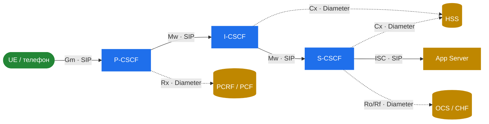

# 10.1 Що таке IMS — і де тут Kamailio

> [!IMPORTANT]
> Усе до цієї частини трактувало Kamailio як SIP-роутер, який ви програмуєте як заманеться. IMS — протилежна позиція: **стандартизована** архітектура (3GPP TS 23.228), де кожна коробка має визначену роль, визначеного сусіда і визначений протокол на кожному лінку. Kamailio не перестає бути SIP-роутером — його *відливають* у конкретні IMS-ролі, що звуться CSCF. Ця частина — про це відливання: які ролі грає Kamailio, з чим він говорить, і що ще треба прикрутити навколо, щоб отримати робоче VoLTE/VoWiFi-ядро.

## IMS в одному абзаці

IMS — **IP Multimedia Subsystem** — це стандартизований 3GPP спосіб доставляти SIP-сервіси (голос, відео, повідомлення) поверх мобільного чи фіксованого пакетного ядра. Це сигнальний мозок за **VoLTE** (голос поверх LTE), **VoWiFi** і **VoNR** (голос поверх 5G NR). Коли ваш телефон робить «звичайний» виклик у 4G/5G-мережі — цей виклик є SIP-сесією, піднятою через IMS-ядро, а медіа їде по RTP на виділеному bearer'і. IMS — це те, що змушує суто пакетну мережу поводитися як телефонна.

## Чому SIP-роутер стає «CSCF-нодами»

Звичайний SIP-proxy — чистий аркуш: логіку маршрутизації пишете ви. IMS натомість розщеплює proxy-функцію на три стандартизовані ролі, разом — **CSCF** (Call Session Control Function):

- **P-CSCF** — Proxy CSCF: перший хоп, з яким говорить пристрій (UE). Край безпеки і доступу.
- **I-CSCF** — Interrogating CSCF: точка входу в домашній домен. Обирає, який S-CSCF обслуговує користувача.
- **S-CSCF** — Serving CSCF: реєстратор і мозок. Автентифікує користувачів, тримає стан реєстрації, тригерить сервіси.

Kamailio реалізує всі три. Замість того, щоб *ви* вирішували маршрутизацію в `request_route`, стандарт фіксує flow виклику, а ви налаштовуєте Kamailio під відповідність. Модулі `ims_*` цю відповідність і реалізують.

SIP-reference-points (Gm, Mw, ISC) Kamailio реалізує повністю. Diameter'ні (Cx, Rx, Ro/Rf) він не реалізує — він запитує зовнішній peer і діє за відповіддю. Операційні сюрпризи концентруються на цій межі; див. [10.3](33-ims-diameter.md).

## Модель reference-points

IMS описує мережу як коробки, з'єднані іменованими лінками — **reference points**. Кожен reference point фіксує і протокол, і дозволені на ньому повідомлення. Без цієї карти IMS-розгортання не зрозуміти — кожне рішення в конфізі впирається в «а який це reference point?».

| Reference point | Протокол | Між | Несе |
|---|---|---|---|
| **Gm** | SIP | UE ↔ P-CSCF | Реєстрацію і виклики від пристрою |
| **Mw** | SIP | CSCF ↔ CSCF | SIP між трьома CSCF-ролями |
| **Cx** | Diameter | I/S-CSCF ↔ HSS | Дані абонента, auth-вектори, вибір S-CSCF |
| **Rx** | Diameter | P-CSCF ↔ PCRF/PCF | Авторизацію медіа, QoS, запит виділеного bearer'а |
| **Ro / Rf** | Diameter | S-CSCF ↔ OCS | Онлайн- (Ro) і офлайн- (Rf) білінг |
| **ISC** | SIP | S-CSCF ↔ Application Server | Тригерінг сервісів (SMS, voicemail, supplementary) |

Сині коробки — це Kamailio. Золоті — все інше, що вам потрібно, і решта цієї частини здебільшого про них.

> [!NOTE]
> У 5G-ядрі (SBA — Service-Based Architecture) Diameter-reference-points мають HTTP/2-еквіваленти: Cx→N70, Rx→N5, Ro/Rf→N40/N45. Саме IMS-ядро в більшості реальних розгортань лишається на SIP+Diameter; SBA-мапінг — це те, як IMS втикається в 5G control plane. Торкаємося цього лише там, де воно важливе.

## Що ця частина покриває — і що ні

**Покриває:** роль кожного CSCF, як модулі `ims_*` їх реалізують, flow реєстрації end-to-end, як Kamailio говорить Diameter, які компоненти треба навколо для повного рішення, і конкретний софтовий стенд, що зшиває все докупи.

**Не покриває:** проходження по RFC/TS, параметричний довідник по модулях, byte-level-кодування IPSec чи Diameter, і будь-яких заяв, що автор цього посібника тримає продакшн-IMS. За самими стандартами — TS 23.228 / 24.229 авторитетні; ця частина — *карта*, не територія.

---

  [← Зміст](../) · [← 9.3 Що нового](30-whats-new.md) · [Далі: 10.2 Ролі CSCF →](32-ims-cscf.md)

