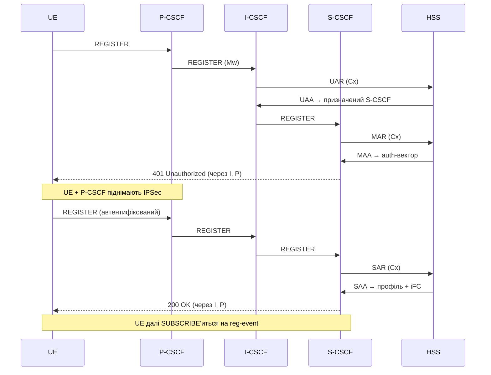

# 10.2 Ролі CSCF на Kamailio

> [!IMPORTANT]
> CSCF — це одна логічна функція, розщеплена на три ролі. У реальному розгортанні кожна роль зазвичай — **окремий процес Kamailio** (часто окремий контейнер) зі своїм конфігом і своїми listening-сокетами — вони говорять між собою по reference-point Mw так, ніби це коробки різних вендорів. Це розділення і є суттю: воно дозволяє масштабувати і захищати кожну роль незалежно.

Немає ні «P-CSCF-бінаря», ні «S-CSCF-бінаря». Це той самий Kamailio; роль задається тим, які `ims_*`-модулі завантажені і як налаштовані. P-CSCF — це `kamailio -f proxy.cfg`; S-CSCF — це `kamailio -f serving.cfg`. Процесна модель, shm і routing-движок незмінні — IMS це модулі на тому самому ядрі.

## Три ролі

### P-CSCF — край доступу

Proxy-CSCF — єдина IMS-коробка, з якою пристрій взагалі говорить напряму (по **Gm**). Усе, що шле UE, йде спершу сюди, і все назад виходить звідси. Його задачі:

- Термінувати **IPSec**-асоціацію з UE (пристрій і P-CSCF домовляються про неї під час реєстрації).
- Бути якорем для **медіа-політики** — говорить **Rx** з PCRF, щоб авторизувати медіа і запросити виділений bearer з правильним QoS.
- Вставляти/перевіряти заголовки, на які спирається IMS (`P-Asserted-Identity`, `Service-Route`, `Path`).

Модулі: `ims_registrar_pcscf`, `ims_usrloc_pcscf`, `ims_ipsec_pcscf`, `ims_qos`.

### I-CSCF — точка входу в домен

Interrogating-CSCF — вхідні двері в домашню мережу. Він навмисно тонкий і майже stateless: коли приходить REGISTER чи вхідний виклик для користувача цього домену, I-CSCF питає HSS (по **Cx**), *який S-CSCF має це обробити*, і форвардить туди. На реєстрації шле **UAR** (User-Authorization-Request); на термінуючому виклику — **LIR** (Location-Info-Request).

Модуль: `ims_icscf`.

### S-CSCF — реєстратор і мозок

Serving-CSCF — там, де живе справжня робота. Це **SIP-реєстратор** користувача, він його **автентифікує**, тримає стан реєстрації і виконує сервіс-профіль, тригерячи Application Server'и по **ISC**. Задачі:

- Витягти auth-вектор користувача з HSS (**MAR**/**MAA** по Cx) і зачеленджити UE.
- Зберігати стан реєстрації в `ims_usrloc_scscf` (ключ — IMPU/IMPI, див. нижче).
- Завантажити **iFC** користувача (initial Filter Criteria) з HSS і застосувати — вони вирішують, які Application Server'и заходять у які виклики.
- Драйвити білінг через `ims_charging` (Ro/Rf).

Модулі: `ims_registrar_scscf`, `ims_usrloc_scscf`, `ims_auth`, `ims_isc`, `ims_charging`, `ims_dialog`.

## Карта модулів

| Роль | Модулі | Говорить з |
|---|---|---|
| **P-CSCF** | `ims_registrar_pcscf`, `ims_usrloc_pcscf`, `ims_ipsec_pcscf`, `ims_qos` | UE (Gm), PCRF (Rx) |
| **I-CSCF** | `ims_icscf` | HSS (Cx) |
| **S-CSCF** | `ims_registrar_scscf`, `ims_usrloc_scscf`, `ims_auth`, `ims_isc`, `ims_charging`, `ims_dialog` | HSS (Cx), AS (ISC), OCS (Ro/Rf) |
| **усі** | `cdp`, `cdp_avp` | Diameter-peer'и (див. [10.3](33-ims-diameter.md)) |

> [!NOTE]
> Ці модулі прийшли в Kamailio з проєкту **OpenIMSCore** — оригінальної опенсорс-референс-реалізації IMS. Значну частину поточної IMS-роботи в Kamailio веде NG Voice (Carsten Bock). Вони GPLv2, як і решта не-core-модулів.

## Реєстрація — канонічний flow

IMS-реєстрація — знаменито **двопрохідний** обмін: перший REGISTER отримує челендж (401), пристрій піднімає IPSec, і другий REGISTER завершує справу. Простежити одну реєстрацію end-to-end — найшвидший спосіб зрозуміти, як три ролі кооперуються.

Чотири Cx-команди тут — серце справи:

| Команда | Хто шле | Навіщо |
|---|---|---|
| **UAR** / UAA | I-CSCF | «Чи цьому користувачу сюди можна, і який S-CSCF його обслуговує?» |
| **MAR** / MAA | S-CSCF | Витягти auth-вектор, щоб зачеленджити UE |
| **SAR** / SAA | S-CSCF | Зареєструвати адресу S-CSCF у HSS, завантажити профіль + iFC |
| **LIR** / LIA | I-CSCF | (термінуючі виклики) «На якому S-CSCF цей користувач зараз зареєстрований?» |

Після успішної реєстрації UE одразу **SUBSCRIBE'иться на event-пакет `reg`**. Це не опційна прикраса: у SIP немає network-initiated DEREGISTER, тож мережа дереєструє користувача, шлючи `NOTIFY` на цю підписку з `Subscription-State: terminated` (TS 23.228 §5.3, RFC 3680). Без підписки мережа ніколи не змогла б знести застарілу реєстрацію на своїх умовах — reg-event-підписка *і є* єдиним держаком мережі за реєстрацію, яку вона не завершувала.

> [!TIP]
> Два факти, важливі для масштабу і не видимі з діаграми. **Кожна успішна реєстрація коштує 401-round-trip:** перший REGISTER завжди челенджиться, тож шлях — це два REGISTER'и і два Cx-обміни (UAR+MAR, потім SAR) — 2× SIP- і Diameter-навантаження на реєстрацію під час storm'у. **IPSec P-CSCF — це справжній kernel-`xfrm`-стан:** `ims_ipsec_pcscf` програмує Linux-IPSec-стек із SA, прив'язаними до портів, узгоджених у 401. Саме тому P-CSCF потребує privileged networking у контейнері, на відміну від I-CSCF і S-CSCF.

## Де живе стан

IMS-ідентичності бувають двох ґатунків, і S-CSCF ключує стан на обидва:

- **IMPI** — IP Multimedia *Private* Identity: credential-ідентичність (одна на підписку, для auth). Думайте «SIM».
- **IMPU** — IP Multimedia *Public* Identity: дзвонибельна ідентичність (`sip:` / `tel:` URI). Підписка може мати кілька.

Один IMPI може володіти кількома IMPU, а IMPU групуються в **implicit registration set** — зареєструй один, і весь набір реєструється разом. `ims_usrloc_scscf` на S-CSCF тримає цей граф: які IMPU зареєстровані, проти яких контактів, з яким iFC. Це IMS-специфічний родич звичайного [патерну `usrloc`](18-usrloc.md) з Part 6 — та сама ідея in-memory-plus-DB, набагато багатша схема, і той самий трюк для кластеризації: реплікувати кеш між S-CSCF-інстансами через [`dmq`](23-dmq.md), а не гатити в БД.

Тригерінг сервісів працює з того самого стану. **iFC завантажуються один раз, у SAR/SAA на реєстрації, і кешуються** на S-CSCF. Рішення, чи має виклик завернути через Application Server — це далі локальний матч проти кешованих правил; «виклик» AS — це S-CSCF SIP-маршрутизує запит назовні по ISC і назад. ISC — це звичайний SIP; «IMS service control» — це S-CSCF, що проксує INVITE через AS, обраний із кешованого набору правил.

> [!WARNING]
> `ims_usrloc_scscf` з DB-персистентністю наразі покладається на **захардкоджений SQL** у модулі — тому реляційна БД (MySQL/MariaDB) лишається протоптаним шляхом для стану S-CSCF, навіть попри те, що Redis/Valkey легший. Враховуйте це при sizing'у — див. [10.4](34-ims-full-solution.md).

---

  [← Зміст](../) · [← 10.1 Огляд IMS](31-ims-overview.md) · [Далі: 10.3 Сторона Diameter →](33-ims-diameter.md)

