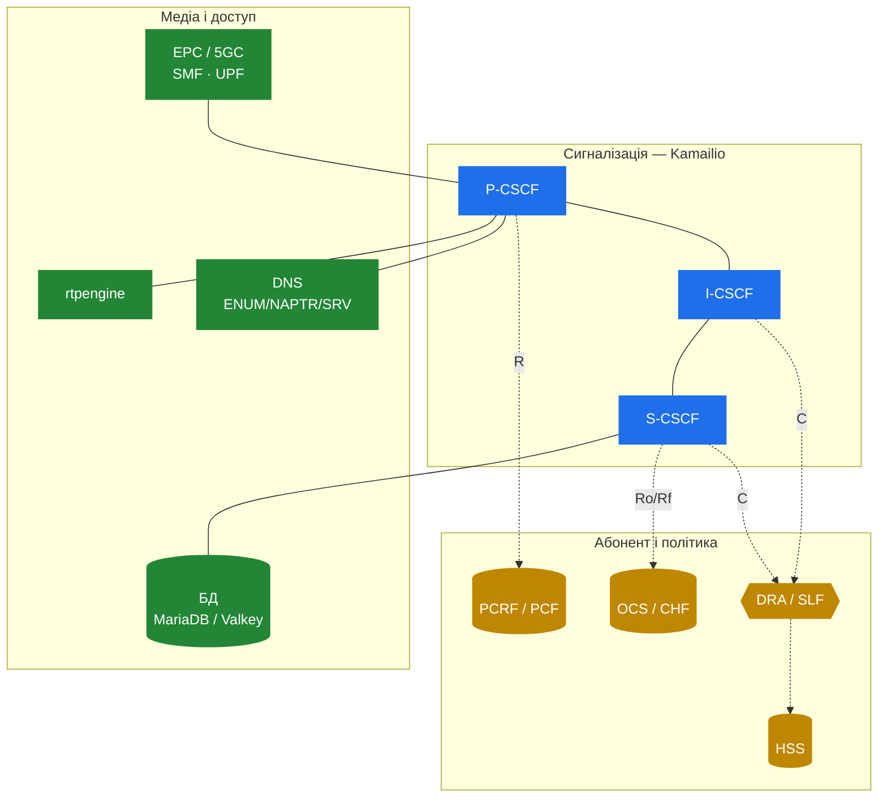

# 10.4 Що ще треба навколо Kamailio

> [!IMPORTANT]
> **Kamailio — це сигнальна плоскість CSCF, і нічого більше.** Він реєструє користувачів, маршрутизує SIP і запитує Diameter-peer'и. Він не зберігає абонентів, не вирішує політику, не тарифікує виклики і не торкається RTP. Робочий IMS — це Kamailio плюс системи навколо, описані нижче.

## Межа

| Kamailio (CSCF) робить | Kamailio **не** робить |
|---|---|
| SIP-реєстрацію і маршрутизацію (P/I/S-CSCF) | Зберігає базу абонентів |
| Челендж автентифікації (на векторах HSS) | Генерує auth-вектори |
| Тригерить сервіси через iFC/ISC | Сам є application-сервером |
| Просить QoS/медіа-політику (Rx) | Вирішує чи енфорсить політику |
| Просить білінг (Ro/Rf) | Тарифікує чи виставляє рахунок |
| — | Релеїть чи транскодить медіа (RTP) |

Усе в правій колонці — окрема система.

## Компоненти навколо

**HSS — Home Subscriber Server.** База абонентів і генератор auth-векторів. Kamailio говорить із ним по Cx. Опенсорс-вибір, що працює: **open5gs** (його HSS-функція).

**PCRF / PCF — політика.** Вирішує, чи медіа-потік дозволений і який QoS отримає, і каже ядру підняти виділений bearer. P-CSCF говорить із ним по Rx. Знову open5gs.

**OCS / CHF — білінг.** Онлайн-білінг (prepaid-баланс, резервування кредиту) і офлайн (генерація CDR). S-CSCF говорить по Ro/Rf. Опенсорс-вибір: **CGRateS** — потужний real-time rating-движок із Diameter-агентом.

**DRA / SLF — Diameter-маршрутизація.** У будь-чому складнішому за single-HSS-лаб ви ставите **Diameter Routing Agent** між CSCF та HSS/PCRF/OCS, щоб CSCF мав один Diameter-peer замість N. Опенсорс-вибір: **freeDiameter** як relay/DRA.

**rtpengine — медіа.** Релеїть (і опційно транскодить/шифрує) RTP і робить ICE/SRTP для WebRTC-доступу. Kamailio керує нею через модуль `rtpengine`, але сам медіа не несе.

**DNS.** IMS-маршрутизація сильно спирається на DNS: **NAPTR/SRV** для пошуку CSCF, **ENUM** для перетворення `tel:`-номерів у SIP-URI. Поламаний резолвер ламає маршрутизацію викликів так, що це виглядає як баги CSCF. **CoreDNS** — чистий вибір (і він уже дефолт у Kubernetes).

**БД.** Стан реєстрації S-CSCF потребує персистентності, щоб пережити рестарти. **MariaDB/MySQL** — тестований шлях для `ims_usrloc_scscf` (захардкоджений SQL — див. [10.2](32-ims-cscf.md)); **Valkey/Redis** легший і саме його хоче rtpengine для HA, але потребує обробки схеми на боці Kamailio.

**EPC / 5GC-ядро.** Пристрою потрібен IP-bearer і маршрут до P-CSCF, перш ніж усе вищесказане застосовне. Це пакетне ядро — **SMF/UPF** у 5G, PGW у 4G — яке також виявляє адресу P-CSCF і (разом із PCRF) піднімає виділений голосовий bearer. open5gs покриває і це.

**Моніторинг.** І Diameter, і SIP падають тихо; вам потрібні **Prometheus/Grafana** для метрик і **Loki**-подібна агрегація логів із першого дня, плюс packet capture (`sip || diameter || gtpv2`) для неминучого дебагу flow'ів.

## Мінімальний повний стек

> **Kamailio** (P/I/S-CSCF) + **open5gs** (HSS, PCRF, SMF, UPF) + **CGRateS** (OCS) + **freeDiameter** (DRA) + **rtpengine** (медіа) + **CoreDNS** + **БД** + **Prometheus/Grafana/Loki** + тестовий **UE**.

Це список компонентів, зібраний у стенді з [10.5](35-ims-lab.md).

---

  [← Зміст](../) · [← 10.3 Сторона Diameter](33-ims-diameter.md) · [Далі: 10.5 Софтовий IMS-стенд →](35-ims-lab.md)

