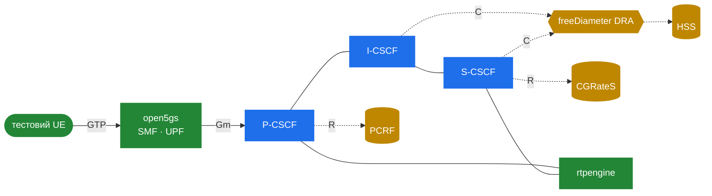

# 10.5 Робочий референс — софтовий IMS-стенд

> [!IMPORTANT]
> Діаграми заводять лише до певної межі. Найшвидший спосіб *зрозуміти* IMS — підняти повний на ноутбуці й дивитися на пакети. Проєкт [**`lyatanski/ims`**](https://github.com/lyatanski/ims) — саме це: цілком софтовий IMS-плейграунд — Kamailio CSCF плюс повний supporting cast — зшитий докупи через Docker Compose і Helm. Цей розділ читає його як навчальний артефакт: що в ньому, як шматки мапляться на все в цій частині, і чому це гарне місце для старту.

> [!NOTE]
> `lyatanski/ims` — сторонній лаб, що підтримується незалежно від цього посібника. Сприймайте його як навчально-тестовий референс, не як production-blueprint, і звіряйтеся з репозиторієм щодо поточного стану — він активно розвивається.

## Що це

Відтворюваний, цілком опенсорсний IMS-core, який підіймаєте однією командою `docker compose` (і передеплоюєте на Kubernetes через прикладені Helm-чарти). Його заявлені цілі промовисті: *софтовий плейграунд для тестування*, *документування конфігурації опенсорс-компонентів* і *чисте Compose-рішення*, що також постачає **Helm-чарти** для Kubernetes. Він цілить у VoLTE/5G-flow'и і тримається реальних 3GPP-специфікацій (TS 23.228, 24.229, Cx 29.228/229, Rx 29.214, charging 32.299).

## Компоненти, змапані на цю частину

Стек розбитий на Compose-профілі — IMS, core network, billing, monitoring, test — які лягають майже один-в-один на [10.4](34-ims-full-solution.md):

| Шар | Компонент | Грає роль | Покрито в |
|---|---|---|---|
| IMS-сигналізація | **Kamailio** (P/I/S-CSCF) | CSCF | [10.2](32-ims-cscf.md) |
| Медіа | **rtpengine** | медіа-релей | [10.4](34-ims-full-solution.md) |
| Маршрутизація | **CoreDNS** | NAPTR/SRV/ENUM | [10.4](34-ims-full-solution.md) |
| Стан | **MariaDB / Valkey** | стор S-CSCF / rtpengine | [10.2](32-ims-cscf.md) |
| Абонент/політика | **open5gs** | HSS, PCRF | [10.3](33-ims-diameter.md) |
| Пакетне ядро | **open5gs** | SMF, UPF (CUPS) | [10.4](34-ims-full-solution.md) |
| Diameter-маршрутизація | **freeDiameter** | DRA | [10.3](33-ims-diameter.md) |
| Білінг | **CGRateS** | OCS | [10.3](33-ims-diameter.md) |
| Моніторинг | **Prometheus · Grafana · Loki · cAdvisor · Promtail** | observability | [10.4](34-ims-full-solution.md) |
| Тестовий UE | **Doubango**-форк + **go-gtp** | телефон | — |



## Як усередині налаштований Kamailio

Найцікавіше для цього посібника — конфігурація CSCF. Лаб тримає три ролі як окремі конфіги Kamailio зі спільною базою:

- `common.cfg` — спільні завантаження модулів і дефолти
- `proxy.cfg` — **P-CSCF**
- `interrogating.cfg` — **I-CSCF**
- `serving.cfg` — **S-CSCF**
- `5g.cfg`, `monitor.cfg` — 5G-специфічна обв'язка і metrics/health-ендпоінт

У цих конфігах можна вичитати точний набір `ims_*`-модулів, що описувала ця частина — список loadmodule включає:

```
cdp            cdp_avp            ims_auth
ims_icscf      ims_registrar_pcscf  ims_registrar_scscf
ims_usrloc_pcscf  ims_usrloc_scscf  ims_ipsec_pcscf
ims_isc        ims_qos            ims_charging
ims_dialog     rtpengine          db_redis
```

плюс звичні робочі конячки (`tm`, `rr`, `sl`, `sanity`, `siputils`, `textops`, `pv`, `presence`/`pua` для reg-event-підписки, і `xhttp_prom` для Prometheus-метрик). Бачити їх завантаженими разом, у role-specific-файлах — найясніше можливе підтвердження мапи роль→модуль із [10.2](32-ims-cscf.md).

## Що з цим робити

Репо постачає flow-доки (`doc/registration.md`, `doc/session.md`, `doc/transaction.md`) і doc по reference-points, що дзеркалить таблицю з [10.1](31-ims-overview.md). Продуктивний цикл:

1. Підняти (`docker compose --profile test up -d` — воно вантажить kernel-модуль, тож рекомендована VM).
2. Дивитися на дріт: `wireshark -i any --display-filter 'gtpv2 or sip or diameter.cmd.code != 280'` (відфільтрувавши Diameter-watchdog'и).
3. Тригернути реєстрацію і простежити двопрохідний flow із [10.2](32-ims-cscf.md) пакет за пакетом — REGISTER, UAR/UAA, MAR/MAA, 401, IPSec, SAR/SAA, 200, далі reg-event SUBSCRIBE.

Простеживши цей один обмін на дроті, ви мапите всю частину на реальні пакети.

## Інший кут — академічний single-VM-стенд

Cloud-native compose/Helm-стек вище — це один кінець спектру. Інший кінець — і чудовий перший контакт з IMS — це навмисно мінімальний, навчально-орієнтований сетап: **[IMS-Kamailio-Tutorial](https://github.com/anabelen-garcia/IMS-Kamailio-Tutorial)** від Ana Belén García Hernando (Universidad Politécnica de Madrid). Він будує повний IMS на **одній VM**, оптимізований не під реалістичність, а під *чітке бачення flow'ів у Wireshark*.

Чим він повчальний:

- **Усі три CSCF-ролі — це Kamailio.** P-CSCF (`:5060`), S-CSCF (`:6060`) та I-CSCF (`:4060`) крутяться як три окремі процеси Kamailio на одному хості — найясніша можлива демонстрація того, що один шматок софту (Kamailio, тут [форк herlesupreeth](https://github.com/herlesupreeth/kamailio) із його `Kamailio_IMS_Config`-шаблонами) покриває весь шар CSCF. Кожна роль тримає свій `kamailio_*.cfg` (cfg), `*.xml` (конфіг Diameter-peer'а `cdp`) і файл defines.
- **Інший склад компонентів.** Він парує Kamailio з **FHoSS** (Java-HSS від FOKUS з лінії OpenIMSCore) замість open5gs, **bind9** для DNS і **PJSUA** як тестовий UA — корисний контраст із виборами [10.4](34-ims-full-solution.md), що показує: ролі важать більше за конкретні продукти.
- **Чистий IMS, без EPC.** Він навмисно викидає пакетне ядро, тож **немає Rx-інтерфейсу** і підняття bearer'а — чистий спосіб вивчати SIP+Cx-ядро IMS в ізоляції до додавання VoLTE-складності.
- **Capture-first-інженерія.** Кожна функція отримує свій `127.0.0.X`-loopback, а стенд використовує cgroups + iptables SNAT + nflog, щоб один capture показував коректно-адресовані, причинно-впорядковані траси. Ця обв'язка — сама по собі маленький майстер-клас зі спостереження за multi-process-системою.

Обидва стенди зрештою сходяться до канонічного upstream-walkthrough — **[Open5GS «VoLTE Setup with Kamailio IMS and Open5GS»](https://open5gs.org/open5gs/docs/tutorial/02-VoLTE-setup/)** Сукчана Лі (Sukchan Lee) — який варто прочитати окремо як референс-рецепт, від якого походить більшість Kamailio-IMS-сетапів.

## Підсумок

IMS ставить Kamailio в обмежену роль: conformant-CSCF, що володіє SIP-reference-points і делегує Cx/Rx/Ro/Rf зовнішнім Diameter-peer'ам. Два стенди зшивають цю роль двома способами — cloud-native (Compose/Helm, ядро open5gs) і single-VM (FHoSS, фокус на capture). Обидва — read-the-configs, run-the-flows-референси для всього з 10.1–10.4.

---

<p markdown="1" align="center">
  [← Зміст](../) · [← 10.4 Повне рішення](34-ims-full-solution.md) · [На початок →](index.md)
</p>
