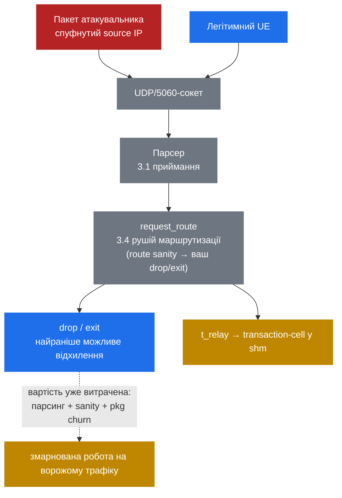

# 9.1 Поверхня атаки SIP — і чому UDP/5060 відкритий

> [!IMPORTANT]
> Кожна попередня частина цього довідника припускала дружній input — UE, який ви провізіонили, peer, якому ви довіряєте, конфіг, який ви написали. Part 9 цю презумпцію скидає. Інтернет прямо зараз говорить із вашим `5060`-сокетом, і більшість того, що він шле, — вороже. Кут тут — internals: *де* байти атакувальника живуть усередині Kamailio і *що* їх — і що ні — sanitize'ить, перш ніж ваш скрипт отримає слово.

## Публічний UDP/5060-сокет не має вхідних дверей

UDP не має handshake. Немає SYN/ACK, немає стану з'єднання, немає нічого, що доводило б, що відправник — це той, ким його видають `Via` і source IP. Датаграма приходить, ядро віддає її нагору, receive-loop Kamailio її читає — а source IP у заголовку пакета — це те, що відправник туди вписав, і на UDP він тривіально спуфиться. Атакувальник може підробити будь-яку source-адресу, яка не відфільтрована ingress-фільтром між ним і вами.

Тож будь-хто, хто може заroutити пакет до вашого порту, може надіслати синтаксично валідний `INVITE`, `REGISTER` чи `OPTIONS`. Транспорт цього ніяк не гейтить. Єдине, що стоїть між незнайомцем і вашою routing-логікою, — це логіка, яку ви написали.

І вони шукають. Автоматичні сканери безперервно прочісують IPv4-простір — `sipvicious` (інструмент, що в багатьох форках досі ставить `friendly-scanner` у `User-Agent`) і його нащадки пробують кожен досяжний `5060` у пошуках сервера, який відповідає. Свіжовиставлений Kamailio отримує свій перший непроханий `OPTIONS` за хвилини, не за дні. Експозиція — це не питання того, чи вас таргетять; це фоновий стан публічного SIP-порту.

## Класичні кейси зловживань

| Атака | Що робить атакувальник | Мета |
|---|---|---|
| REGISTER hijack | Брутфорсить чи replay'їть credentials, аби прив'язати свій контакт до вашого AOR | Вкрасти ідентичність — перехоплювати дзвінки, дзвонити від імені жертви |
| INVITE toll fraud | Домагається, щоб неавтентифікований `INVITE` зарелеїли в бік PSTN-шлюзу | Робити дорогі дзвінки за чужий рахунок |
| OPTIONS/UA recon | Шле `OPTIONS` (чи `REGISTER`/`INVITE`-проби), аби прочитати `Server`/`Allow` і поенумерувати extension'и | Зняти fingerprint стеку і змапити валідні AOR перед атакою |
| Flood / DoS | Випускає високий rate запитів — часто malformed чи напівзавершених транзакцій | Вичерпати CPU, пам'ять чи bandwidth, доки сервіс не деградує |

## Що неавтентифіковане повідомлення вже вам коштує

Ось internals-гачок, який робить раннє фільтрування важливим: вороже повідомлення робить реальну роботу всередині Kamailio *перш ніж* ваш скрипт зможе його відхилити.

Кожна датаграма, що дістається сокета, йде тим самим шляхом, що й легітимна. Receive-loop парсить першу лінію і індексує межі заголовків ([3.1 приймання](07-reception.md)), а тоді виконується `request_route` ([3.4 рушій маршрутизації](10-routing-engine.md)). Ваші захисти живуть *усередині* цього route'а — рання in-route-перевірка на кшталт lookup'у в ban-таблиці по source-IP чи `route("sanity")`, а тоді ваш перший `drop`/`exit`. Найдешевше можливе відхилення все одно стається *після* парсингу і *після* того, як routing уже почався — гачка «відхилити до парсингу» в скрипті не існує.

Ледаче парсування заголовків більшість часу тримає цю вартість обмеженою. Kamailio парсить заголовки on-demand, не жадібно ([3.2 розпарсене повідомлення](08-parsed-message.md)), тож проба, яку ви дропаєте після однієї перевірки `$rm`, дешева. Але заголовки контролює атакувальник. Скрафчені, надмірні чи патологічні набори заголовків можуть змусити повний парсинг — а тіло з `Content-Length`, якому ви довіряєте, тягне ще більше роботи. Скільки парсера відпрацює — вирішує атакувальник, не ви.

Далі — пам'ять. Кожне повідомлення в польоті churn'ить `pkg` (приватну пам'ять процесу), а в мить, коли ви обробляєте будь-що stateful'но — `t_relay`, auth-challenge, будь-що, що створює транзакцію — ви алокуєте transaction-cell у `shm` ([2.2 архітектура пам'яті](03-memory-architecture.md)). Flood напіввідкритих транзакцій, які ніколи не завершуються, — це не bandwidth-атака; це memory-exhaustion DoS. Пакети можуть бути дрібними, а rate помірним, і ви все одно можете висушити `shm`, тримаючи стан транзакцій для дзвінків, що ніколи не завершаться.

## Межі довіри

Несуче правило: **на UDP source IP — це не ідентичність.** Без digest-auth ви не можете нічого виснувати про те, *хто* надіслав пакет, з того, *звідки* він начебто прийшов. Allowlist'и за source IP корисні лише там, де шлях між вами і джерелом довірений (приватний лінк до відомого peer'а), ніколи — на відкритому access-edge.

Це ділить вашу топологію на дві зони:

- **Access-edge** — UE десь в інтернеті. За замовчуванням недовірені. Усе тут має бути автентифіковане (digest) або відфільтроване, перш ніж заслужить будь-яку дорогу обробку.
- **Core** — шлюзи, медіа-сервери, peer-SIP-сервери. Довірені тому, що досяжні через контрольовані лінки і/або автентифіковані як peer'и, а не через те, звідки начебто походять їхні пакети.

Цей фрейм рухає решту Part 9: **фільтруй дешево і рано, автентифікуй решту.** Відхиляй очевидне сміття з якнайменшою роботою, а тоді витрачай реальний CPU лише на трафік, що його заслужив.

Суть діаграми — у пунктирній лінії: ворожий пакет їде *тим самим* пайплайном, що й хороший, а найраніша точка відхилення все одно нижче за течією від парсингу — усередині `request_route`, щойно відпрацювали ваші ранні in-route-перевірки. Усе до `drop` — це робота, яку ви зробили на користь атакувальника.

Тож мета — посунути цю точку відхилення якомога лівіше — і зробити її якомога дешевшою. Це [9.2](37-security-modules.md): модулі, що дають відхиляти раніше і дешевше, починаючи з rate-limiting за source IP у `pike` і далі — дедалі селективніші фільтри, перш ніж ви взагалі витратите транзакцію.

---

  [← Зміст](../) · [← 7.3 Event routes](26-event-routes.md) · [Далі: 9.2 Захисні модулі →](37-security-modules.md)

