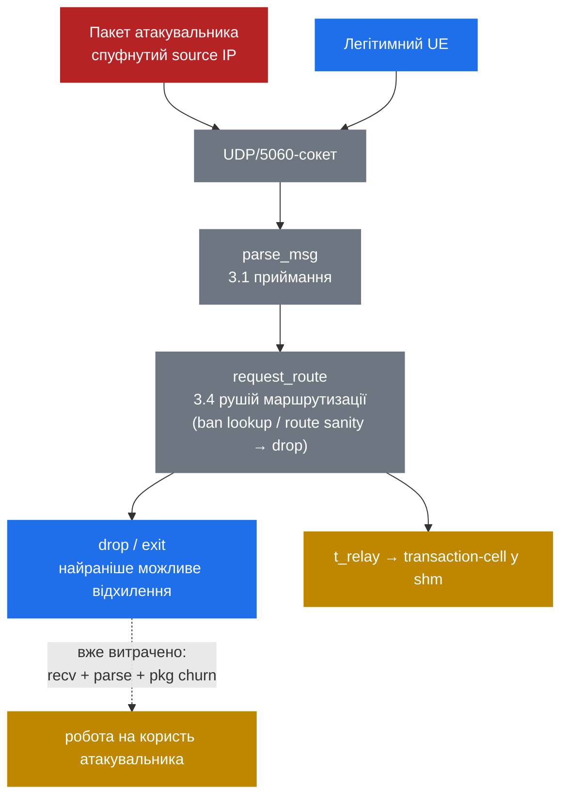

# 9.1 Поверхня атаки SIP — і чому UDP/5060 відкритий

> [!IMPORTANT]
> Кожна попередня частина припускала дружній input. Part 9 це скидає. Ваш `5060`-сокет приймає ворожий трафік прямо зараз; справжнє питання — скільки роботи витягує з Kamailio чужий пакет *перш ніж* ваш скрипт зможе сказати «ні». Кут тут — internals: де байти атакувальника приземляються і що торкається їх на шляху до вашого першого `drop`.

## Без handshake'а, без ідентичності

UDP не несе стану з'єднання. Source IP — це те, що відправник туди вписав; на UDP він тривіально спуфиться до будь-якого, що не відфільтровано ingress-фільтром між ним і вами — тому apparent origin не доводить нічого, і будь-хто, хто може заroutити до вашого порту, надсилає синтаксично валідний `INVITE`/`REGISTER`/`OPTIONS` прямо в `request_route`. Транспорт нічого не гейтить; ваш конфіг — весь периметр.

Сканування безперервні: `sipvicious` та його форки (досі штампують `friendly-scanner` у `User-Agent`) прочісують IPv4-простір у пошуках чого завгодно, що відповідає, і свіжовиставлений інстанс отримує перший непроханий `OPTIONS` за хвилини. Експозиція — це фоновий стан публічного SIP-порту, не подія.

| Атака | Механізм | Мета |
|---|---|---|
| REGISTER hijack | Брутфорс чи replay credentials, прив'язати свій `Contact` до вашого AOR | Вкрасти ідентичність — перехоплювати і розміщувати дзвінки від імені жертви |
| INVITE toll fraud | Домогтися, щоб неавтентифікований `INVITE` зарелеїли до PSTN-шлюзу | Дзвінки за чужий рахунок |
| UA/OPTIONS recon | Читати `Server`/`Allow`, енумерувати AOR'и | Зняти fingerprint стеку, змапити цілі |
| Flood / half-open DoS | Високий rate, часто malformed чи ніколи-не-завершені | Вичерпати CPU, `pkg`/`shm` чи bandwidth |

## Що вже коштував відхилений пакет

Гука «відхилити до парсингу» не існує. Кожна датаграма — ворожа чи ні — читається в буфер receiver'а, проганяється через `parse_msg()` (перша лінія плюс перший прохід з індексуванням діапазонів байтів імені та значення кожного заголовка, [3.1](07-reception.md)), і лише тоді *входить* у `request_route` ([3.4](10-routing-engine.md)). Ваш найранніший можливий `drop` — lookup в ban-таблиці по source IP, `route("sanity")` — відпрацьовує, коли routing уже йде. Найдешевше відхилення в Kamailio все одно пост-парсингове, пост-диспетчерне.

Ледаче парсування ([3.2](08-parsed-message.md)) зазвичай обмежує цю вартість: значення заголовків лишаються нерозпарсеними, поки щось їх не читає, тому проба, яку ви дропаєте після одного тесту `$rm`, дешева. Але заголовки контролює атакувальник — oversized, глибоко згорнуті чи патологічні набори штовхають `parse_headers()` на справжню роботу, а довірений `Content-Length` затягує тіло. Скільки парсера відпрацює — вирішує атакувальник, не ви.

Пам'ять — гостріший край. Кожне повідомлення в польоті churns'ить per-process `pkg`; у мить, коли ви стаєте stateful — `t_relay`, auth-challenge — `tm` алокує transaction-cell у shared `shm` ([2.2](03-memory-architecture.md)) і тримає її до фінального reply чи таймера. `INVITE`, що ніколи не отримає фінального відповіді, утримує cell до закінчення `fr_inv_timer` (за замовчуванням **120 с**). Скромний rate ніколи-не-завершених транзакцій паркує тисячі cell'ів у фіксованому пулі `-m` — не bandwidth-атака, а `shm`-exhaustion, після якої алокації фейляться і *легітимні* дзвінки дропаються. Маленькі пакети, скромний rate — реальний outage.

## Межі довіри

**На UDP source IP — це не ідентичність.** Без digest-auth ви не можете нічого виснувати про відправника з того, звідки начебто прийшов пакет, тому allowlist за source IP має сенс лише на шляху, яким ви керуєте (приватний лінк до відомого peer'а) — ніколи на відкритому access-edge. Це ділить топологію: **access-edge** — недовірені UE, автентифікуйте або фільтруйте до будь-якої дорогої обробки — і **core** — шлюзи й peer'и, довірені через контрольовані лінки та peer-auth, а не через apparent origin. Звідси доктрина для решти Part 9: **фільтруй дешево і рано, автентифікуй решту.**

Пунктирна лінія — це суть: ворожий і хороший пакети ділять один пайплайн, а перше відхилення — нижче за течією від парсингу. Посунути його лівіше і зробити дешевшим — це [9.2](37-security-modules.md): rate-limiting у `pike` і дедалі селективніші фільтри перш ніж ви взагалі витратите транзакцію.

---

  [← Зміст](../) · [← 7.3 Event routes](26-event-routes.md) · [Далі: 9.2 Захисні модулі →](37-security-modules.md)

