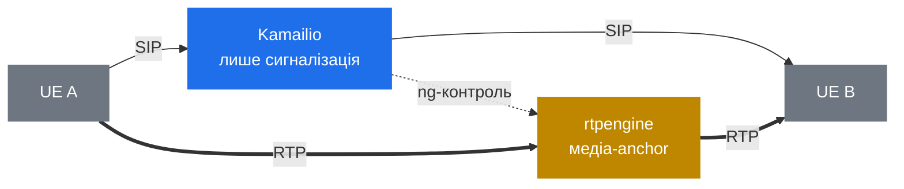
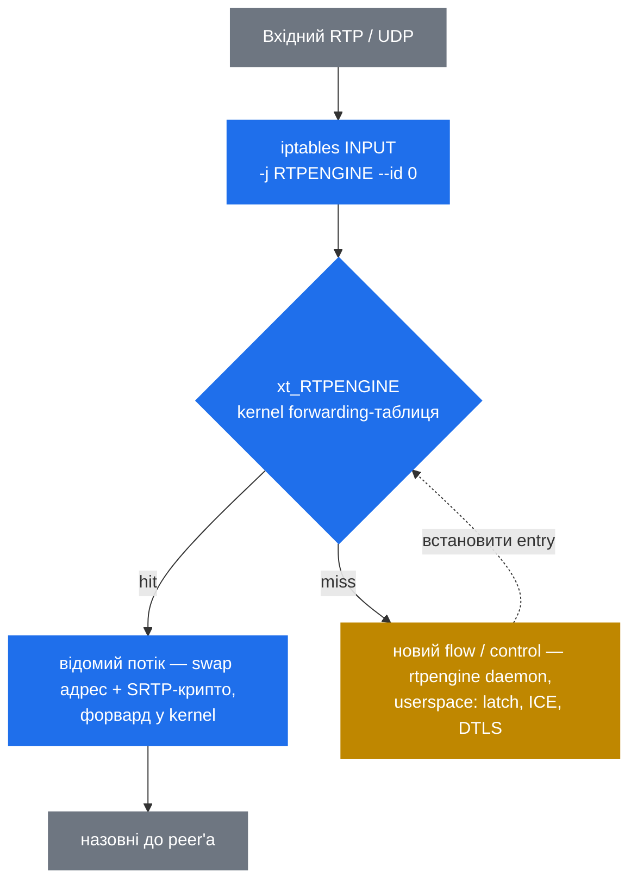

# 8.6 Медіа — rtpengine та RTP-шлях

> [!IMPORTANT]
> Усе розглянуте досі рухало *сигналінг*. Kamailio ніколи не торкається `RTP` — медіа тече між ендпоїнтами напряму, і SIP-проксі не має що робити на цьому шляху. Крім випадків, коли це необхідно: NAT, несумісність шифрування і topology-hiding змушують закріплювати медіа на ретрансляторі. `rtpengine` — цей ретранслятор, і керується він повністю з routing-скрипта. Ось як медіа-площина приєднується до сигнальної.

## Навіщо медіа-ретранслятор взагалі

Kamailio маршрутизує `INVITE`'и і переписує SDP, але `RTP`/`RTCP` йдуть прямо між юзер-агентами — це сигнальний box, не медіа. Два ендпоїнти за різними NAT'ами не можуть досягти одне одного напряму: адреси в їхньому SDP приватні. Тому ставиш публічно-досяжний ретранслятор посередині, переписуєш SDP `c=`/`m=` кожної сторони, щоб вони вказували на нього, і він пробрасовує потоки. Той самий anchor дає більше: topology-hiding на медіа-стороні (жодна зі сторін не дізнається адресу іншої), call-recording, транскодинг і — найважливіше тут — крипто-шлюз між ендпоїнтами, що не поділяють медіа-профіль безпеки.

`rtpproxy` був оригіналом — керований аналогічно через однойменний модуль Kamailio. `rtpengine` (sipwise) замінив його: SRTP/DTLS, транскодинг, ICE і in-kernel-форвардинг. Вважайте `rtpproxy` legacy-мінімальним ретранслятором, а `rtpengine` — дефолтним вибором.



Тонкі стрілки — SIP (через Kamailio); товсті — RTP (через rtpengine, ніколи через Kamailio); пунктир — `ng` control-канал. Kamailio переписує SDP кожної сторони, щоб обидві медіа-ноги приземлялися на anchor.

## Керування з конфіга

Модуль `rtpengine` спілкується з демоном через **ng-протокол** — бенкодовані словники через UDP, навмисно несумісні зі старим rtpproxy control-протоколом. Вказуєте один або кілька демонів:

```
modparam("rtpengine", "rtpengine_sock", "udp:127.0.0.1:12221")
# weighted-інстанси або іменовані set'и:
modparam("rtpengine", "rtpengine_sock", "1 == udp:10.0.0.1:12221 udp:10.0.0.2:12221")
```

Три функції відповідають SDP offer/answer-хендшейку:

- `rtpengine_offer()` на вхідному `INVITE` — переписує offer-SDP, виділяє relay-порти.
- `rtpengine_answer()` на `200 OK` — переписує answer з відповідними портами.
- `rtpengine_delete()` на `BYE`/failure — звільняє сесію.

На практиці викликаєте `rtpengine_manage()`, який сам обирає offer/answer/delete з методу і напрямку — один рядок закриває загальний випадок. Поведінка задається flag-рядком на виклику — `replace-origin replace-session-connection ICE=remove RTP/AVP …` — а `set_rtpengine_set(N)` вибирає, який daemon-set обробляє сесію. Сесія ідентифікується по `Call-ID`; rtpengine тримає порт, крипто і стан лернінгу, а Kamailio лише підштовхує його на offer, answer і teardown.

## RTP bleed і `strict source`

Ретранслятор відкриває публічну UDP-порт-пару на потік і, щоб пережити symmetric NAT, *лачиться*: вчить справжню адресу peer'а з першого вхідного `RTP`-пакета і форвардить туди. Цей лернінг і є дірою. **RTP bleed** (клас rtpbleed 2017 року) — атакуючий сканує ваш медіа-діапазон і стріляє `RTP` у відкритий порт; ретранслятор лачиться на адресу атакуючого і починає копіювати аудіо жертви до нього — пасивне підслуховування — або дає йому інджектити медіа в дзвінок. Ніякого сигналінгу, ніякої авторизації, лише вгаданий відкритий порт.

Мітигація — прапор **`strict source`**: після того як ендпоїнт вивчено, rtpengine порівнює source-адресу і порт кожного пакета з вивченими і *дропає* розбіжності замість повторного лачіння. Протилежне — `media-handover` — перевчається і переміщується на нову адресу: правильно для справжньої мобільності, але саме те, чого не треба на публічному edge там, де bleed-ризик реальний, тому тримайте його подалі від публічного краю. Підкріплюйте `strict source` закритим, несканованим медіа-діапазоном і edge-фільтрацією з [9.1](36-security-surface.md): порт існує, ви просто відмовляєтеся слідувати туди, куди сигналінг не обіцяв.

## SRTP, DTLS і WebRTC-міст

rtpengine термінує медіа-крипто і шлюзує *транспортний профіль* між leg'ами — саме це дозволяє plain-RTP SIP-телефону спілкуватися з зашифрованим WebRTC-браузером в одному дзвінку. Профіль задається per-leg через переписування SDP-транспорту у offer/answer-прапорах:

- `RTP/AVP` — plain RTP. `RTP/SAVP` — SRTP з SDES-ключуванням (ключі в `a=crypto`-рядках SDP). `RTP/AVPF` / `RTP/SAVPF` — feedback-профілі. `UDP/TLS/RTP/SAVPF` — DTLS-SRTP, WebRTC-транспорт.
- `DTLS=passive|active|off` — роль у DTLS-хендшейку; `SDES`-сімейство налаштовує або вимикає SDES і впорядковує крипто-suite'и.

WebRTC↔SIP-дзвінок — одна rtpengine-сесія, що бриджує два профілі: до браузера пропонується `UDP/TLS/RTP/SAVPF` з DTLS; до SIP-leg'а переписується на `RTP/AVP`. rtpengine термінує DTLS-SRTP з боку браузера, розшифровує і емітує plain RTP до телефона — зашифровуючи зворотний шлях. Той самий механізм даунгрейдить SRTP-only-транк до plain-RTP-core'а, чи навпаки.

## ICE і STUN

WebRTC також вимагає ICE, і rtpengine — повноцінний ICE-агент — тобто він говорить **STUN**: збирає кандидати і відповідає на STUN binding (connectivity-check) запити, які браузер надсилає для перевірки шляху, тому ICE завершується проти самого ретранслятора, а не проти далекого ендпоїнта. Керуєте прапором `ICE`: `ICE=force` синтезує свіжий набір кандидатів до ендпоїнта (додати ICE для браузера), `ICE=remove` знімає ICE для UA, що не підтримує його (plain SIP-телефон), `ICE=optional` (дефолт) залишає все, як є. Це друга половина мосту: `ICE=force` + `DTLS` + `UDP/TLS/RTP/SAVPF` до браузера, `ICE=remove` + `RTP/AVP` до телефона.

## Kernel-mode — як пакети оминають демон

Вартість ретранслятора — per-packet: навантажений box рухає мільйони `RTP`-пакетів на секунду, і userspace-копія на пакет обмежує вас рано. rtpengine уникає цього через kernel-модуль.

Демон обробляє ng control-протокол і *перші* пакети кожного потоку в userspace — саме там відбуваються лачіння, ICE і DTLS-хендшейк. Як тільки потік підтверджено (обидва кінці вивчені), демон встановлює forwarding-entry в таблицю kernel-модуля **`xt_RTPENGINE`**. Перехоплення — iptables-правило на медіа-діапазоні:

```
iptables -I INPUT -p udp -j RTPENGINE --id 0
```

Таргет `RTPENGINE` (прив'язаний до `--table 0` демона) передає кожен вхідний UDP-пакет kernel-модулю, який шукає його в in-kernel forwarding-таблиці: **hit** — пакет переписується (swap адрес плюс SRTP-decrypt/encrypt для зашифрованого потоку) і відправляється назад повністю в kernel, без копіювання в userspace; **miss** — проваль до демона (новий flow або control-пакет). Якщо модуль вивантажено — все автоматично повертається до userspace.



Результат: медіа в steady-state — це forwarding-table-lookup в kernel, а демон бачить лише setup, teardown і час від часу новий flow — десятки тисяч одночасних дзвінків на одному box'і. Потоки, що *не можуть* йти в kernel — ті, що потребують кожного пакета в userspace: recording і транскодинг.

---

<p markdown="1" align="center">
  [← Зміст](../) · [← 8.5 dmq](23-dmq.md) · [Далі: 8.7 Захоплення SIP через TLS →](41-siptrace.md)
</p>
