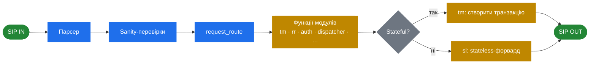

<h1 align="center">Kamailio Handbook — Українська</h1>

  <em>Архітектурний розбір SIP-сервера Kamailio.</em>

  
  
  

---

> [!NOTE]
> Цей посібник пояснює, *як побудований Kamailio* і *чому* — дизайнерські рішення, внутрішню механіку, архітектурні патерни. Він доповнює [офіційну документацію](https://www.kamailio.org/wikidocs/), а не замінює її.

## Як SIP-запит проходить через Kamailio

Одне отримане SIP-повідомлення проходить через цей конвеєр — і більшість того, що в конфізі Kamailio виглядає як «магія», це просто вибір гілки на цьому шляху.

## Зміст

### 1. Передмова
- 1.1 Вступ — що таке Kamailio і навіщо він
- 1.2 Швидкий старт — мінімум, щоб розуміти архітектурні розділи

### 2. Архітектура (основний фокус)
- 2.1 Огляд — місце Kamailio у VoIP-стеку
- 2.2 Основи SIP — форма протоколу, яка визначає всі рішення
- 2.3 Процесна модель і конкурентність — воркери, таймери, спільна пам'ять
- 2.4 Конвеєр обробки запитів — як SIP-повідомлення проходить через сервер
- 2.5 Мова конфігурації — DSL, навіщо він, що він вирішує
- 2.6 Система модулів — завантаження, життєвий цикл, експортовані функції, залежності
- 2.7 Управління станом — `tm`, `dialog`, `usrloc`, де і як зберігається стан
- 2.8 Транспортний рівень — UDP, TCP, TLS, WebSocket, слухачі, з'єднання
- 2.9 Абстракція БД — API `db_*`, відокремлення логіки від сховища
- 2.10 Control plane — RPC, MI, `kamcmd`, точки спостереження

### 3. Патерни конфігурації
- 3.1 Базові параметри, які варто розуміти
- 3.2 Логіка маршрутизації — `request_route`, branch/failure/onreply
- 3.3 Псевдо-змінні та трансформації

### 4. Ключові модулі (архітектурні розбори)
- 4.1 Огляд модулів — категорії та логіка вибору
- 4.2 `tm` — рівень транзакцій
- 4.3 `dialog` — stateful-відстеження викликів
- 4.4 `dispatcher` — балансування навантаження та failover
- 4.5 `rtpengine` — інтеграція з media plane
- 4.6 `registrar` + `usrloc` — сервіс локації

### 5. Патерни розгортання
- 5.1 Registrar-сервер
- 5.2 Outbound proxy
- 5.3 Балансувальник навантаження
- 5.4 WebSocket-шлюз

### 6. Експлуатація (з урахуванням архітектури)
- 6.1 Логування
- 6.2 Моніторинг
- 6.3 Усунення несправностей з першопринципів

### 7. Довідник
- 7.1 Шпаргалка з псевдо-змінних
- 7.2 RPC-команди
- 7.3 Глосарій

---

  <a href="../en/README.md">🇬🇧 English</a> · <a href="../../README.md">↑ На головну</a>

