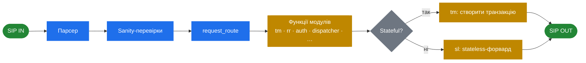

<h1 align="center">Kamailio Handbook — Українська</h1>

  <em>Як Kamailio влаштований зсередини.</em>

  
  
  

---

> [!IMPORTANT]
> Цей посібник **свідомо не переказує офіційну документацію**. Передбачається, що ви вже знаєте, що таке Kamailio на поверхні. Натомість тут — занурення в рантайм, життєвий цикл повідомлень, движок скриптів, KEMI та архітектурні фішки, які формують поведінку Kamailio. Розділу «модуль за модулем» тут не буде.

**Використані джерела:**

- [asipto/kamailio-devel-guide](https://github.com/asipto/kamailio-devel-guide) — посібник з внутрішнього устрою від оригінального мейнтейнера; глибоко про data lumps, парсер, пам'ять, локи, RPC.
- [kamailio.org/wikidocs](https://www.kamailio.org/wikidocs/) — фонова інформація та поверхневе API.
- [github.com/kamailio/kamailio](https://github.com/kamailio/kamailio) — реальна імплементація в C, фінальне джерело істини.
- Для **Part 10 (IMS)**:
    - [lyatanski/ims](https://github.com/lyatanski/ims) — cloud-native софтовий IMS-стенд (Compose + Helm).
    - [anabelen-garcia/IMS-Kamailio-Tutorial](https://github.com/anabelen-garcia/IMS-Kamailio-Tutorial) — академічний single-VM-туторіал Kamailio+FHoSS (UPM).
    - [Open5GS «VoLTE Setup with Kamailio IMS»](https://open5gs.org/open5gs/docs/tutorial/02-VoLTE-setup/) — upstream-туторіал, від якого обидва походять.

## Як SIP-запит проходить через Kamailio

```mermaid
flowchart LR
    In([SIP IN]) --> Parser[Парсер]
    Parser --> Sanity[Sanity-перевірки]
    Sanity --> RR[request_route]
    RR --> Mods[[Функції модулів<br/>tm · rr · auth · dispatcher · …]]
    Mods --> Decision{Stateful?}
    Decision -- так --> TM[tm: створити транзакцію]
    Decision -- ні --> SL[sl: stateless-форвард]
    TM --> Out([SIP OUT])
    SL --> Out

    classDef io fill:#238636,stroke:#238636,color:#fff
    classDef core fill:#1f6feb,stroke:#1f6feb,color:#fff
    classDef mod fill:#bf8700,stroke:#bf8700,color:#fff
    classDef branch fill:#6e7681,stroke:#6e7681,color:#fff

    class In,Out io
    class Parser,Sanity,RR core
    class Mods,TM,SL mod
    class Decision branch
```

Одне отримане SIP-повідомлення проходить через цей конвеєр. Більшість того, що в конфізі Kamailio виглядає «магічно», — це просто вибір гілки на цьому шляху. Цей посібник розбирає кожен прямокутник вище.

## Зміст

### 1. Передмова
- [1.1 Вступ](01-introduction.md) — сигналізація проти медіа, ментальна модель, чого чекати ✅
- [1.2 SIP за 60 секунд](01b-sip-primer.md) — транзакції, діалоги, positive/negative ACK, роль проксі ✅

### 2. Рантайм
- [2.1 Процесна модель](02-process-model.md) — main, attendant, timer, воркери: для чого кожен ✅
- [2.2 Архітектура пам'яті](03-memory-architecture.md) — `pkg` vs `shm`, кастомний алокатор, правила життєвого циклу ✅
- [2.3 Примітиви конкурентності](04-concurrency.md) — локи, atomic-операції, per-bucket шардинг ✅
- [2.4 Життєвий цикл](05-lifecycle.md) — старт, перезавантаження конфігу, graceful shutdown ✅
- [2.5 Sizing & tuning](06-sizing-and-tuning.md) — воркери, пам'ять, kernel-кнопки під паттерн трафіку (proxy / registrar / stateful / WS) ✅

### 3. Життєвий цикл SIP-повідомлення
- [3.1 Прийом](07-reception.md) — сокети, слухачі, як транспорт демультиплексує ✅
- [3.2 Розпарсене повідомлення](08-parsed-message.md) — структура `sip_msg`, **lazy**-парсинг заголовків, ціна ✅
- [3.3 Lumps](09-lumps.md) — як мутації *чергуються*, а не застосовуються одразу (це і є той самий speed-trick) ✅
- [3.4 Движок маршрутизації](10-routing-engine.md) — `request_route`, `reply_route`, `onreply_route`, `branch_route`, `failure_route`, `event_route` ✅
- [3.5 Форвардинг і відповіді](11-forwarding.md) — складання вихідного повідомлення з buffer'а та lump'ів ✅

### 4. Движок скриптів
- [4. Script engine — pointer-розділ](29-script-engine.md) — тонка карта де про script-engine-машинерію написано в інших розділах, плюс ті кілька внутрішніх деталей (форма AST, диспетчеризація псевдо-змінних, конвенція return-value) що нікуди не вмістилися ✅

### 5. KEMI — embedded scripting
- [5.1 Яку проблему вирішує KEMI](12-kemi-overview.md) — коли cfg DSL перестає вистачати ✅
- [5.2 Bridge](13-kemi-bridge.md) — як Lua, Python, JS, Ruby вбудовуються в C-рантайм ✅
- [5.3 Lifecycle](14-kemi-lifecycle.md) — per-worker-інтерпретатор, що переживає повідомлення, reload ✅
- [5.4 Tradeoffs](15-kemi-tradeoffs.md) — коли виграє KEMI, коли native cfg, гібридний патерн ✅

### 6. Стан, транзакції, діалоги
- [6.1 Транзакції (`tm`)](16-tm-internals.md) — хеш-таблиці у shm, timer wheels, retransmission ✅
- [6.2 Діалоги](17-dialogs.md) — як `dialog` доповнює `tm` для відстеження повного виклику ✅
- [6.3 Патерн `usrloc`](18-usrloc.md) — in-memory кеш, DB-sync, узагальнено ✅

### 7. Control plane
- [7.1 Архітектура RPC](24-rpc-architecture.md) — BINRPC vs JSON-RPC, command registry, auth ✅
- [7.2 `kamcmd`](25-kamcmd.md) — важіль оператора, п'ять команд для повсякдення ✅
- [7.3 Event routes](26-event-routes.md) — програмовані хуки в життєвий цикл рантайму ✅

### 8. Архітектурні фішки
- [8.1 Topology hiding (`topos`)](19-topos.md) — переписування виклику так, щоб топологія зникла ✅
- [8.2 Async-транзакції](20-async-transactions.md) — `t_suspend` / `t_continue` для неблокуючих сценаріїв ✅
- [8.3 `htable`](21-htable.md) — хеш-таблиці у спільній пам'яті як «бідний Redis» ✅
- [8.4 `dispatcher`](22-dispatcher.md) — hash-based stickiness, набори шлюзів, failover-алгоритми ✅
- [8.5 `dmq`](23-dmq.md) — синхронізація стану між інстансами Kamailio ✅

### 9. Довідник
- [9.1 Глосарій ролей процесів](27-process-roles.md) — хто є хто в `ps`-виводі ✅
- [9.2 Карта термінів](28-term-map.md) — швидкий глосарій Kamailio-specific ✅
- [9.3 Що нового і що в розробці](30-whats-new.md) — версійний ландшафт (5.8 → 6.0 → 6.1), нові модулі, заархівовані, де стежити за devel ✅

### 10. Kamailio в IMS
- [10.1 Що таке IMS і де тут Kamailio](31-ims-overview.md) — 3GPP-фреймінг, ролі CSCF, модель reference-points (Gm/Mw/Cx/Rx/Ro/ISC) ✅
- [10.2 Ролі CSCF на Kamailio](32-ims-cscf.md) — P/I/S-CSCF, модулі `ims_*`, двопрохідний flow реєстрації, де живе стан ✅
- [10.3 Сторона Diameter](33-ims-diameter.md) — `cdp`/`cdp_avp`, Cx/Rx/Ro, peer state machine, async-у-воркері ✅
- [10.4 Що ще треба навколо Kamailio](34-ims-full-solution.md) — HSS, PCRF, OCS, DRA, rtpengine, DNS, ядро — чесна межа ✅
- [10.5 Робочий референс — софтовий IMS-стенд](35-ims-lab.md) — стек `lyatanski/ims` і академічний single-VM-туторіал ✅

### 11. Безпека і hardening
- [11.1 Поверхня атаки SIP і модель загроз](36-security-surface.md) — чому публічний UDP/5060-сокет відкритий; ціна неавтентифікованого повідомлення; межі довіри 🚧
- [11.2 Захисні модулі](37-security-modules.md) — `sanity`, `secfilter`, `pike`, `topoh`, digest-auth — що насправді перевіряє кожен 🚧
- [11.3 Динамічні блок-листи: apiban та ipban](38-security-blocklists.md) — стоковий antiflood у `kamailio.cfg` (htable `ipban` + `pike`) і фід apiban.org 🚧
- [11.4 Fuzzing і кейс command-injection → RCE](39-security-fuzzing-rce.md) — fuzzing парсера; як SIP-заголовок стає reverse-shell, і де Kamailio є/не є вразливим 🚧

---

  <a href="../en/">🇬🇧 English</a>

